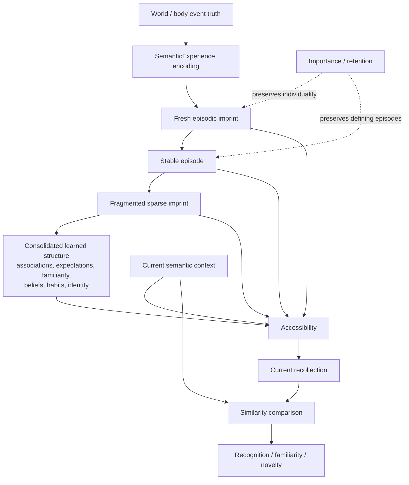
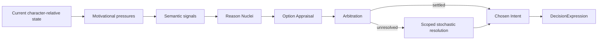
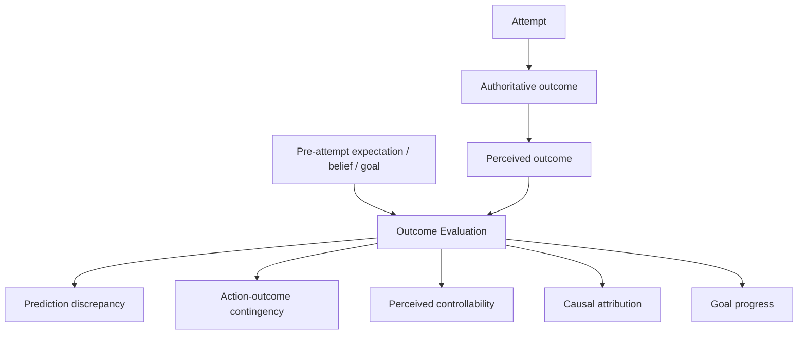
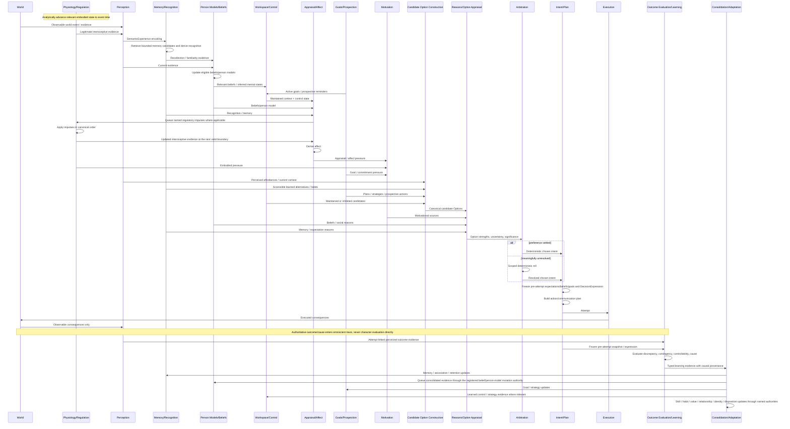
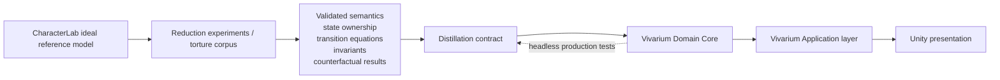

# CharacterLab — Ideal Character Architecture Map

**Status:** Ideal architecture map subordinate to the Ideal Character Architecture North Star

**Authority:** [`CharacterLab — Ideal Character Architecture North Star`](CharacterLab%20%E2%80%94%20Ideal%20Character%20Architecture%20North%20Star.md) governs required capabilities, invariants, and research posture. This document explains that architecture visually and structurally; it is not an implementation-status report or roadmap.

**Scope:** The complete ideal character topology, causal seams, state ownership, deterministic ordering, research boundaries, reference-file drafting map, and eventual Vivarium distillation constraints.
**Purpose:** Keep the whole character model legible as one intentionally overcomplete reference architecture so CharacterLab can simplify it experimentally without repeatedly discovering missing upstream layers.

---

## 1. Document role after the CharacterLab reset

CharacterLab has restarted under a different research premise.

The old framing asked:

> What is the smallest character model we can build, and what must we add when it fails?

The new framing asks:

> **What is the most complete causally legible model of the person we currently believe may be necessary, and which distinctions can we subsequently prove unnecessary?**

This document therefore no longer distinguishes between:

- implemented architecture;
- planned architecture;
- future architecture.

There is one architecture described here:

> **the ideal reference architecture.**

Every box is part of the current superset hypothesis unless explicitly marked as a candidate distinction that may later be derived, merged, compressed, substituted, or retracted.

That does **not** mean every mechanism is accepted.

The North Star remains explicit that the reference architecture is an intentionally overcomplete hypothesis. CharacterLab must make its seams executable and traceable, then attempt to remove them.

### 1.1 What previous CharacterLab work means now

Previous phases, source files, tests, equations, and experimental findings remain useful, but their role has changed.

They may serve as:

- drafted reference implementations;
- control models;
- candidate equations;
- test fixtures;
- retained deterministic infrastructure;
- evidence from prior experiments;
- examples of semantic contracts;
- falsifiable competing mechanisms.

They do **not** serve as architectural authority merely because they already exist.

A component being present in a reference file means only:

> **CharacterLab already has one drafted way to express this idea.**

It does not mean:

> this is the architecture we must continue extending.

Likewise, a component not yet drafted in a reference file is not “future architecture.” It is already part of the ideal topology if the North Star requires the distinction.

### 1.2 What belongs elsewhere now

This architecture document should not own:

- current implementation status;
- phase completion status;
- the next coding task;
- active branch/worktree state;
- a proof ledger tied to old phase numbers;
- delivery sequencing;
- production milestone scheduling.

Those concerns belong in the new CharacterLab planning/building brief and experiment-specific documents.

This map exists to answer:

> **What causal structure are we trying to make experimentally available?**

---

## 2. Diagram strategy

Use **Mermaid as the canonical architecture-diagram source**, but do not force every question into one enormous graph.

| Question | Diagram type | Why |
| --- | --- | --- |
| What are the person's major causal systems? | Mermaid flowchart | Best overview of component boundaries and causal direction. |
| What state is constitutional, persistent, derived, active, or historical? | Mermaid ownership graph | Prevents duplicate truth and accidental modifier soup. |
| What happens during one experience / decision / action? | Mermaid sequence diagram | Makes event ordering and feedback boundaries explicit. |
| How do memory and biography become durable structure? | Mermaid lifecycle graph | Makes consolidation and provenance legible. |
| How does one person model another person? | Mermaid observer-target graph | Keeps target truth separate from observer belief. |
| What has already been drafted in reference files? | Mapping table | Records reusable work without turning implementation status into architecture. |
| How does CharacterLab distill into Vivarium? | Boundary diagram | Preserves semantic findings without requiring identical code shapes. |

Regulatory time-series, learning curves, calibration plots, and ablation results belong in experiment outputs rather than in the canonical architecture map.

### 2.1 Notation

This document uses only architecture/research notation, not implementation status:

- **Required capability** — a phenomenon or boundary the eventual model must preserve.
- **Candidate distinction** — a separate seam retained in the ideal reference model until experiments justify reduction.
- **Derived** — computed from other authoritative state rather than independently mutable truth.
- **Historical / frozen** — retains the meaning and provenance it had when the event occurred.
- **Reference-drafted** — one or more existing CharacterLab files already contain a possible mechanism, equation, type, or control path for the concept. This is informational, not authoritative.

The absence of a `reference-drafted` note says nothing about architectural importance.

---

## 3. Executive ideal architecture

The complete ideal character should be understood as a deterministic causal network rather than a personality vector or linear decision pipeline.

```mermaid
flowchart TB
    World[World Truth and Events]

    subgraph Character[CHARACTER]
        direction TB

        subgraph Constitution[PERSISTENT CONSTITUTION AND DEVELOPMENT]
            Bio[Biological Constitution<br/>candidate physiological parameters]
            RegK[Regulatory Kinetics<br/>production, decay, sensitivity,<br/>thresholds, adaptation]
            Psych0[Psychological Baseline<br/>only dimensions proven irreducible]
            Dev[Developmental / Age State<br/>maturation, aging, life-stage<br/>where behaviorally required]
        end

        subgraph Embodied[EMBODIED STATE]
            Phys[Physiological State<br/>energy, hydration, sleep debt,<br/>injury, pain, etc.]
            Reg[Regulatory State<br/>stress/reward/arousal-like dynamics]
            RegAdapt[Regulatory Adaptation<br/>tolerance, sensitization,<br/>accumulated load]
            Intero[Interoception<br/>character-accessible body evidence]
        end

        subgraph Learned[PLASTIC LEARNED STATE]
            Disp[Learned Dispositional Adaptation]
            Values[Values / Durable Preferences]
            Self[Self-concept / Consolidated Identity]
            Habits[Habits / Learned Action Tendencies]
            Skill[Skill / Procedural Competence]
        end

        Effective[Current Effective Disposition<br/><i>derived</i>]

        subgraph Memory[KNOWLEDGE AND MEMORY]
            Percept[Perception / Attention]
            SemExp[SemanticExperience]
            Beliefs[Predictive / Causal Beliefs]
            Episodic[Episodic Imprints]
            Assoc[Associations]
            Expect[Expectations]
            Person[Observer-specific Person Models<br/>dispositions, affect, goals,<br/>intentions, knowledge]
        end

        Recognition[Recognition / Familiarity / Novelty<br/><i>derived from context + surviving memory</i>]

        subgraph ActiveCog[ACTIVE COGNITION]
            Workspace[Active Cognitive Workspace<br/>limited maintained contents]
            Control[Cognitive Control<br/>maintenance, inhibition,<br/>switching, monitoring, reappraisal]
        end

        Relationships[Directional Relationship State<br/>history, attachment, trust/resentment,<br/>multidimensional lenses]

        Appraisal[Appraisal<br/>meaning, threat, control,<br/>social evaluation, incongruity, etc.]
        Affect[Appraised Affect<br/>fear, amusement, embarrassment,<br/>relief, pride, shame, guilt, etc.]

        Prospection[Prospection / Goal Management<br/>future states, intentions,<br/>strategies, prospective reminders]
        Motives[Motivational Pressures<br/>physiological, psychological,<br/>social, goals, commitments]
        OptionGen[Candidate Option Construction<br/>affordances, plans, habits,<br/>accessible alternatives]
        Reasons[Semantic Reasons / Reason Nuclei]
        OptionAppraisal[Option Appraisal<br/>strength, uncertainty,<br/>tradeoffs, conflict]
        Arbitration[Decision Arbitration<br/>settledness, significance,<br/>unresolved conflict]

        Roll[Scoped Roll<br/>only where meaningful uncertainty remains]
        Intent[Chosen Intent]
        DecisionExpr[DecisionExpression<br/>frozen semantic meaning of the choice]
        PreAttempt[Pre-attempt Snapshot<br/>expectations, beliefs, goals,<br/>intent and relevant context]

        CommIntent[Communicative Intent<br/>what private state is meant to express]
        ActionPlan[Action / Communication Plan<br/>how intent will be attempted]
        PerceivedOutcome[Perceived Outcome Evidence<br/>attempt-linked character evidence only]
        OutcomeEval[Outcome Evaluation<br/>prediction discrepancy, contingency,<br/>controllability, causal attribution]
        LearningEvidence[Learning Evidence / Candidate Updates<br/>typed, attributed, provenance-bearing]
        Consolidation[Consolidation / Adaptation Transitions<br/>distinct candidate mechanisms<br/>behind one mutation boundary family]
    end

    Attempt[Attempted Action / Expression]
    Outcome[Executed Outcome / Consequences]
    Signal[Observable Semantic Signal]
    Trace[Omniscient Causal Trace<br/>diagnostic truth, never character evidence]

    Bio --> Phys
    World -. time / developmental events .-> Dev
    Dev --> Phys
    RegK --> Reg
    Phys --> Reg
    RegAdapt --> Reg
    Phys --> Intero
    Reg --> Intero

    Psych0 --> Effective
    Dev --> Effective
    Disp --> Effective

    World -. observable facts only .-> Percept
    Percept --> SemExp

    Episodic --> Recognition
    Assoc --> Recognition
    Expect --> Recognition
    SemExp --> Recognition

    Percept --> Workspace
    Episodic --> Workspace
    Beliefs --> Workspace
    Prospection --> Workspace
    Appraisal --> Workspace
    Affect --> Workspace
    Workspace --> Control
    Control --> Workspace

    Effective --> Appraisal
    Values --> Appraisal
    Beliefs --> Appraisal
    Person --> Appraisal
    Relationships --> Appraisal
    Intero --> Appraisal
    Recognition --> Appraisal

    Appraisal --> Affect
    Appraisal -. named regulatory impulse .-> Reg
    Affect -. later salience / retrieval bias .-> Percept
    Affect -. later appraisal bias .-> Appraisal
    Affect -. control load .-> Control
    Control -. regulation / reappraisal .-> Appraisal

    Intero --> Motives
    Values --> Motives
    Self --> Motives
    Habits --> Motives
    Beliefs --> Motives
    Relationships --> Motives
    Appraisal --> Motives
    Affect --> Motives
    Prospection --> Motives

    Motives --> Prospection
    Beliefs --> Prospection
    Expect --> Prospection
    Self --> Prospection
    Control --> Prospection

    SemExp --> OptionGen
    Recognition --> OptionGen
    Beliefs --> OptionGen
    Assoc --> OptionGen
    Prospection --> OptionGen
    Habits -. habitual candidate response .-> OptionGen
    Skill -. practiced affordance .-> OptionGen
    Control -. maintain / inhibit candidates .-> OptionGen

    Motives --> Reasons
    Appraisal --> Reasons
    Affect --> Reasons
    Episodic --> Reasons
    Assoc --> Reasons
    Expect --> Reasons
    Person --> Reasons
    Relationships --> Reasons
    Self --> Reasons
    Prospection --> Reasons
    Beliefs --> Reasons

    OptionGen --> Reasons
    OptionGen --> OptionAppraisal
    Reasons --> OptionAppraisal --> Arbitration
    Arbitration -->|settled| Intent
    Arbitration -->|meaningfully unresolved| Roll --> Intent

    Intent --> DecisionExpr
    Intent --> PreAttempt
    Expect --> PreAttempt
    Beliefs --> PreAttempt
    Prospection --> PreAttempt
    DecisionExpr --> PreAttempt
    Intent --> ActionPlan
    Prospection --> ActionPlan
    Skill --> ActionPlan
    Control --> ActionPlan

    Beliefs --> CommIntent
    Affect --> CommIntent
    Intent --> CommIntent
    Control --> CommIntent
    CommIntent --> ActionPlan

    ActionPlan --> Attempt
    Skill --> Attempt
    Phys --> Attempt
    Reg --> Attempt
    Control --> Attempt

    Attempt --> Outcome
    World --> Outcome
    Outcome --> World
    Outcome --> Phys
    Outcome -. observable consequences only .-> Percept
    Outcome --> Signal
    Outcome -. authoritative provenance only .-> Trace
    Attempt -. authoritative provenance only .-> Trace
    Signal --> World

    SemExp -. attempt-linked evidence .-> PerceivedOutcome
    PreAttempt --> OutcomeEval
    PerceivedOutcome --> OutcomeEval

    OutcomeEval --> LearningEvidence
    DecisionExpr --> LearningEvidence
    SemExp --> LearningEvidence
    Reg -. exposure / recovery evidence .-> LearningEvidence

    LearningEvidence --> Beliefs
    LearningEvidence --> Expect
    LearningEvidence --> Episodic
    LearningEvidence --> Person
    LearningEvidence --> Consolidation

    Consolidation --> Assoc
    Consolidation --> Values
    Consolidation --> Relationships
    Consolidation --> RegAdapt
    Consolidation --> Skill
    Consolidation --> Habits
    Consolidation --> Self
    Consolidation --> Disp

```



### 3.1 Core interpretation

The architecture should be read as follows:

> **Persistent constitution and development shape a changing body and effective disposition. Perception and interoception create character-relative evidence rather than omniscient truth. Memory, recognition, beliefs, person models, relationships, active cognition, appraisal, and affect turn evidence into experienced meaning. Motivation and prospective goals compile into semantic reasons. Option appraisal and arbitration determine whether preference is settled or requires stochastic authorship. Chosen intent remains distinct from action planning, skill, attempt, communication, and executed outcome. The character then evaluates what actually seemed to happen against what they expected, and learning updates future belief, skill, habit, identity, memory, relationships, and disposition without rewriting history.**

This is a causal network, not a per-frame loop.

Every feedback edge must be broken by an explicit deterministic transition boundary.

`Candidate Option Construction` is a seam, not a commitment to one universal generator. Whether habitual/procedural activation, deliberative planning, remembered alternatives, and perceived affordances share one construction mechanism is an explicit reduction question. The canonical requirement is that Options do not appear unexplained and that feasibility/availability remains distinct from preference.

`Consolidation / Adaptation Transitions` is likewise a boundary family rather than one universal learning equation. Every persistent learned state must name exactly one mutation authority behind this boundary, even when different state families use different update mathematics.

Evidence-producing arrows therefore do not write learned state directly. They terminate in `LearningEvidence`. Edges from that boundary into beliefs, expectations, memory, and person models, and edges from `Consolidation` into slower learned state, invoke the registered mutation authority for each target family. The mutation registry must keep those authorities exclusive even when one implementation services several targets.

---

## 4. Foundational causal separations

The ideal architecture depends more on preserving **meaningful distinctions** than on preserving particular object names.

The following separations are architectural load-bearing.

### 4.1 World truth is not character evidence

```text
WORLD / BODY TRUTH
        ↓
observation / interoception
        ↓
CHARACTER EVIDENCE
```

A character may fail to perceive, misperceive, or lack access to true state.

Unknown is not neutral.

### 4.2 Evidence is not belief

An observed event is evidence from which belief may update.

The same evidence can update two observers differently because of prior belief, uncertainty, source trust, attention, or interpretation.

### 4.3 Belief is not appraisal

```text
Belief:
"Darius saw me drop the tray."

Appraisal:
"Darius may now think I am incompetent,
and his opinion matters to me."
```

### 4.4 Appraisal is not affect

Threat appraisal, social evaluation, incongruity, control, loss, responsibility, and goal relevance may produce affective conclusions.

Fear, embarrassment, relief, pride, shame, jealousy, amusement, guilt, and frustration are derived meanings, not commands.

### 4.5 Affect is not action

The same fear can support flight, resistance, appeasement, freezing, preparation, concealment, joking, or help-seeking depending on the rest of the person.

### 4.6 Motivation is not action

Needs, commitments, values, relationships, affect, identity, goals, and expectations create reasons.

Reasons compete.

### 4.7 Goal is not motive, plan, or action

A goal represents a desired future state.

A motive creates pressure.

A plan represents a strategy.

An intention commits toward future action.

An action is an attempt in the world.

These may align, but they must not collapse.

### 4.8 Believed capability is not actual competence

```text
SELF-EFFICACY / CAPABILITY BELIEF
≠
PROCEDURAL COMPETENCE
≠
EXPECTED OUTCOME
```

The architecture must support skilled-but-insecure and incompetent-but-overconfident people.

### 4.9 Private state is not expressed communication

An observer does not get access to another character's private belief, affect, goal, or intent merely because those states exist.

Communication is an attempted action with its own planning, skill, inhibition, distortion, and observable output.

### 4.10 Intent is not execution

A person may choose to leave, attempt to leave, and still be physically prevented.

The choice remains their choice.

The forced outcome remains a separate fact.

### 4.11 Authoritative outcome is not perceived outcome

What actually happened and what the character believes happened can diverge.

Learning must use legitimate perceived outcome and causal attribution rather than omniscient simulator cause.

### 4.12 History may change the future but never rewrite the past

Resolved Decisions retain the reasons, uncertainty, expression, and provenance they had at the moment of choice.

Later changes may alter memory or interpretation, but they do not recompute why the historical Decision occurred.

### 4.13 One causal fact must not become modifier soup

A fact may have multiple independently meaningful consequences.

It may not create duplicate Decision pressure merely because several layers can describe it.

Derivation provenance must expose correlated pathways so they can be consolidated or rejected.

---

## 5. State ownership

The ideal architecture should make ownership explicit enough that every piece of data has one authoritative meaning.

```mermaid
flowchart TB
    subgraph PersistentBase[PERSISTENT CONSTITUTIONAL / AUTHORED]
        Bio[Biological Constitution]
        Psych[Psychological Baseline]
        RegParams[Regulatory Kinetics]
        Content[Semantic World / Action / Skill / Norm Definitions]
    end

    subgraph PersistentDynamic[PERSISTENT DYNAMIC CHARACTER STATE]
        Dev[Developmental / Age State]
        Phys[Physiological State]
        Reg[Regulatory State]
        RegAdapt[Regulatory Adaptation]
        Beliefs[Beliefs / Expectations]
        Assoc[Associations]
        Memory[Retained Memory Imprints]
        Values[Values]
        Identity[Self-concept / Identity Evidence]
        Disp[Dispositional Adaptation]
        Habits[Habits]
        Skills[Procedural Skill]
        Goals[Active Goals / Intentions / Plans]
        Social[Directional Person Models / Relationships]
    end

    subgraph Active[EVENT-LOCAL / ACTIVE COGNITION]
        Intero[Current Interoceptive Evidence]
        Perception[Current SemanticExperience]
        Workspace[Active Workspace]
        Appraisal[Current Appraisals]
        Affect[Current Affect]
        Motive[Current Motivational Pressures]
        CandidateOptions[Current Candidate Options / Affordances]
        Reasons[Current Reasons]
        Options[Current Option Appraisal]
        LearningEvidence[Current Learning Evidence / Candidate Updates]
        Consolidation[Current Consolidation Transition]
    end

    subgraph Derived[DERIVED VIEWS]
        Effective[Effective Disposition]
        Recognition[Recognition / Familiarity]
        Diagnostics[Human-readable descriptors]
        RelationshipLens[Current relationship appraisals]
        Confidence[Decision settledness / significance]
    end

    subgraph Historical[FROZEN / HISTORICAL]
        DecisionExpr[DecisionExpression]
        Attempt[Attempt Provenance]
        Outcome[Outcome Provenance]
        Eval[Outcome Evaluation Snapshot]
        Trace[Causal Trace]
    end

    Psych --> Effective
    Dev --> Effective
    Disp --> Effective

    Phys --> Intero
    Reg --> Intero
    Memory --> Recognition
    Assoc --> Recognition
    Perception --> Recognition

    PersistentDynamic --> Active
    PersistentBase --> Active
    Active --> Derived

    Reasons --> DecisionExpr
    DecisionExpr --> Historical
```



### 5.1 Ownership rules

1. A **constitutional parameter** is not a momentary state.
2. A **regulatory level** is not a personality trait.
3. A **Need** is not assumed to be stored state; it may be a derived motivational pressure.
4. **Effective disposition** is derived from persistent contributors and current context rather than independently mutable truth.
5. **Recognition** is derived from current context plus surviving memory; it is not a permanent relationship meter.
6. **Affect** is derived and may have temporal persistence if experiments require it, but must not duplicate its appraisal/regulatory causes.
7. **Current workspace contents** are active cognition, not durable biography.
8. **Skills and habits** are learned persistent states with different causal meanings.
9. **Identity evidence** is not the same as dispositional adaptation.
10. **Historical expression and reasoning** are frozen snapshots, even if current recollection later becomes fuzzy or biased.
11. Every **persistent learned state** has exactly one named mutation authority. Several evidence sources may feed that authority, but no second subsystem may write the same state through an unexplained shortcut.

---

## 6. Constitution, development, and effective disposition

Constitution answers:

> **What persistent starting differences exist before this biography acts upon them?**

The ideal architecture deliberately does not freeze the final dimensions.

### 6.1 Biological constitution

Candidate parameter families may include:

- metabolic kinetics;
- hunger/satiety physiology;
- sleep physiology;
- circadian phase;
- pain/sensory sensitivity;
- immune/recovery parameters;
- reproductive physiology where behaviorally required;
- baseline motor/sensory constraints;
- learning-rate contributors where experiments justify them.

### 6.2 Regulatory constitution

Prefer dynamical parameters over descriptive sliders.

Candidate parameters include:

- baseline / target;
- production sensitivity;
- pulse magnitude;
- rise rate;
- decay / recovery rate;
- response sensitivity;
- activation threshold;
- saturation threshold;
- overload threshold;
- refractory behavior;
- tolerance / sensitization rates;
- cross-axis coupling where required.

Initial research axes may include stress-like, reward-like, and arousal/homeostasis regulation, but the durable abstraction must permit a network if independent axes prove inadequate.

### 6.3 Psychological constitution

No inherited dimension is sacred.

Warmth, Agency, Stability, Sociability, Openness, Discipline, Attunement, or any other candidate may survive only if CharacterLab demonstrates a behavioral distinction that cannot be derived from:

- body;
- regulation;
- memory;
- recognition;
- beliefs;
- active cognition;
- learned expectations;
- values;
- affect;
- social history;
- identity;
- skills/habits;
- or interactions among these.

### 6.4 Developmental / age state

The ideal architecture must not treat adult starting parameters as metaphysically immutable.

Where required, preserve:

```text
PERSISTENT CONSTITUTIONAL PARAMETERS
        +
DEVELOPMENTAL / AGE STATE
        +
PLASTIC ACQUIRED STATE
        ↓
CURRENT EFFECTIVE DISPOSITION
```

This leaves room for maturation, aging, changing sleep architecture, reproductive transitions, changing learning rates, changing regulatory baselines, and cognitive decline without redefining constitution as ordinary acquired learning.

### 6.5 Personality is plastic even if constitution is persistent

A person may begin threat-sensitive and become skilled at coping.

A naturally sociable person may become avoidant.

A low-Agency person may become more assertive through biography.

The model should remember where they began without requiring them to remain there forever.

---

## 7. Embodiment, regulation, interoception, and Needs

### 7.1 Candidate regulatory structure

```mermaid
flowchart LR
    subgraph Params[Regulatory Constitution]
        Base[Baseline / target]
        Prod[Production sensitivity]
        Decay[Decay / recovery]
        Sense[Response sensitivity]
        Thresh[Activation / saturation / overload]
        AdaptP[Adaptation / refractory parameters]
    end

    subgraph Dynamic[Dynamic Embodied State]
        Body[Physiological substrate]
        Reg[Regulatory activation]
        Adapt[Adaptation / tolerance]
        Load[Accumulated load / debt]
    end

    Input[External or appraised stimulus]
    Step[Deterministic analytical transition]
    Intero[Interoceptive evidence]
    Motive[Derived motivational pressure]
    Cog[Contextual cognitive effects]

    Params --> Step
    Dynamic --> Step
    Input --> Step
    Step --> Dynamic
    Dynamic --> Intero
    Intero --> Motive
    Dynamic --> Cog
```



A regulator is not a generic emotion or personality meter.

`Stress` is not `Fear`.

`Reward activation` is not `Pleasure`.

`Arousal` is not `Sociability`.

### 7.2 Interoception is a truth boundary

Characters should not reason from raw hidden physiological state unless they can legitimately sense it.

```text
BODY / REGULATORY TRUTH
        ↓
interoceptive observation
        ↓
CHARACTER-ACCESSIBLE EVIDENCE
        ↓
appraisal / motivation / belief
```

Two characters with identical body truth but different interoceptive sensitivity may therefore experience different pressure.

### 7.3 Need semantics remain open by design

A Need is fundamentally a motivational pressure.

It may be represented as:

- stored state;
- a derived projection of body state;
- a derived projection of interoceptive evidence;
- a hybrid learned/embodied construct;
- or an irreducible psychological motive when no lower-level derivation is justified.

The ideal architecture should support these alternatives without assuming one answer globally.

### 7.4 Status effects are perturbations, not personality bags

An intoxication-like state may alter:

- regulator transitions;
- motor execution;
- sensory precision;
- memory encoding/retrieval;
- inhibition;
- working-memory capacity;
- fatigue;
- risk appraisal.

It should not simply apply `Agency -20`, `Discipline -30`, `Fun +10` unless those semantic changes are actually derived from the perturbation.

---

## 8. Memory, recognition, and consolidation

Memory is not one permanent list of event summaries.



### 8.1 Episodic imprint is not event truth

A memory records what was encoded, not everything that objectively occurred.

Later recall is a reconstruction from surviving traces and current context.

### 8.2 Importance, accessibility, and recognition are distinct

- **Importance / retention:** should this episode remain individually preserved?
- **Accessibility:** how likely is it to be retrieved now?
- **Recognition:** how strongly does the present match surviving memory?

A defining memory may be important but rarely retrieved.

A trivial cue may be highly accessible.

A familiar person may be recognized without retrieving a specific episode.

### 8.3 Affect can bias memory without rewriting history

Affect may alter:

- what is encoded;
- what becomes salient;
- what is later accessible;
- which similar memories are retrieved;
- how recollection is interpreted.

It must not retroactively change the frozen historical event or DecisionExpression.

### 8.4 Progressive consolidation

Routine history should not accumulate as rich individual records forever.

The target is roughly:

```text
recent episodes
+
important defining episodes
+
sparse imprints
+
consolidated associations / expectations / beliefs
+
familiarity
+
identity / relationships / skills / habits where earned
```

Consolidation may compress future causal contribution only when it avoids double-counting the original event and preserves provenance needed for explanation.

### 8.5 Recall may reinforce or reshape retention

Memories repeatedly retrieved into meaningful reasoning may become more important or accessible.

That reinforcement is separate from whether the historical fact itself changes.

---

## 9. Observer-relative person models and relationships

The social model must represent not merely:

> What kind of person do I think you are?

but also, where behaviorally relevant:

> What do I think you currently feel, know, want, intend, or believe?

```mermaid
flowchart LR
    TargetTruth[Target private truth]
    Behavior[Target behavior / expression]
    Observe[Observer perception]
    Evidence[Observer social evidence]

    subgraph Model[Observer-specific Person Model]
        DispBelief[Dispositional / identity belief]
        AffectBelief[Current affect belief]
        GoalBelief[Goal / desire belief]
        IntentBelief[Intention belief]
        KnowledgeBelief[Attributed knowledge / belief]
        Uncertainty[Confidence / uncertainty]
    end

    Relationship[Directional relationship state]
    Lenses[Relationship appraisal lenses<br/>comfort, trust, respect, attraction,<br/>resentment, attachment, reliance, etc.]

    TargetTruth --> Behavior
    Behavior --> Observe --> Evidence --> Model
    Model --> Relationship --> Lenses
```



There is deliberately **no arrow from TargetTruth directly into the observer model**.

### 9.1 The identity matrix remains dispositional belief

The previously strong identity-matrix idea remains valuable as the dispositional part of the broader Person Model.

It should answer questions such as:

- dependable or unreliable;
- warm or cold;
- assertive or yielding;
- attentive or oblivious;
- brave or fearful;
- honest or deceptive;
- rebellious or compliant;

using uncertainty-bearing observer evidence rather than target ground truth.

### 9.2 Current mental-state inference remains distinct

A person may correctly understand someone's durable disposition but misread their current intent.

That distinction matters for misunderstanding, reassurance, deception, embarrassment, jealousy, cooperation, teaching, and attribution.

### 9.3 Theory of mind is bounded

The ideal model does not require infinite recursive minds-inside-minds.

Use sparse first-order observer models and add bounded second-order facts only where a required phenomenon demonstrates the need.

### 9.4 Relationships are directional and multidimensional

`Mina → Darius` and `Darius → Mina` are different states.

Affection, comfort, respect, attraction, reliance, resentment, attachment, and status appraisal must not collapse into one universal friendship score.

### 9.5 Familiarity is separate from liking

Repeated exposure can make someone familiar without making them liked.

Recognition/familiarity may affect appraisal, but it is not itself positive or negative.

---

## 10. Active cognition and cognitive control

The ideal architecture needs a place for the information a person is actively maintaining and the control processes operating over it.

### 10.1 Active cognitive workspace

Candidate contents include:

- current perceptual focus;
- retrieved memory;
- active goal;
- current plan step;
- salient appraisal;
- unresolved Decision alternatives;
- social model of the person currently being considered;
- prospective reminder;
- current instruction or rule.

The workspace should be bounded.

It is not a simulation of continuous inner monologue.

### 10.2 Cognitive control

Candidate functions include:

- maintaining goal-relevant content;
- suppressing a habitual or prepotent response;
- shifting strategies;
- resisting distraction;
- monitoring execution error;
- reappraising an affective interpretation;
- abandoning an unproductive strategy;
- deliberately retrieving or withholding information;
- managing communicative concealment.

Control effectiveness may depend on:

- constitution;
- sleep/fatigue;
- stress/arousal;
- intoxication;
- learned control;
- skill/automaticity;
- competing cognitive load.

### 10.3 Affect is bidirectional with cognition

Affect is not merely a downstream output.

At named later transition boundaries it may influence:

- salience;
- memory accessibility;
- appraisal priors;
- control load;
- strategy flexibility.

Cognitive control may in turn deliberately regulate or reappraise affective meaning.

No same-cycle recursive loop may evaluate itself instantaneously.

---

## 11. Prospection, goals, commitments, and plans

A person should be capable of wanting a future state that is not yet an immediate option.

### 11.1 Prospective state

Candidate persistent prospective state includes:

```text
Goal
├── desired future state
├── importance / commitment
├── horizon
├── progress estimate
├── active strategy / plan
├── prospective cue / reminder
├── abandonment / revision conditions
└── provenance
```

This does not imply an unbounded AI planner.

Planning must remain bounded by semantic affordances, horizon, candidate strategies, and event-driven reevaluation.

### 11.2 Commitments are social/temporal constraints on future action

Commitments may create:

- prospective intentions;
- obligations;
- social accountability;
- schedule constraints;
- reasons in later Decisions.

Fulfillment, relinquishment, failure, or external prevention can all become history without being semantically identical.

### 11.3 Goal conflict is not automatically a Decision

Many low-stakes plan adjustments may be handled by ordinary planning.

A Decision should surface when alternatives are meaningfully contested or authorship-relevant according to the arbitration model.

### 11.4 Procrastination, persistence, and abandonment should emerge

Potential causes include:

- weak goal maintenance;
- competing immediate reward;
- high effort expectation;
- low self-efficacy;
- affective avoidance;
- control load;
- repeated low controllability;
- habit conflict;
- changing values or circumstances.

Avoid a global `Procrastination` or `Persistence` trait unless an irreducible residual remains after those causes are modeled.

---

## 12. Decision architecture

The Decision system exists to preserve meaningful autonomy under competing reasons.



### 12.1 Reasons are semantic compression

Detailed facts should compile into human-scale independent reasons rather than one die/modifier per fact.

The causal trace must preserve the detailed provenance beneath the compressed reason.

### 12.2 Option appraisal is separate from reason generation

Reasons answer:

> Why might this option matter?

Option appraisal answers:

> Given the current set of independent reasons and uncertainty, how strongly does this option stand relative to alternatives?

This seam should remain explicit until experiments prove it can be merged with another layer without losing causal counterfactuals.

### 12.3 Settled preference and unresolved preference differ

A strong clear preference need not roll merely because the game contains dice.

A genuinely unresolved preference may use scoped deterministic randomness.

### 12.4 Significance and uncertainty are distinct

An unresolved trivial choice may roll quietly.

An unresolved identity-relevant or high-stakes choice may become player-facing.

The exact mathematics remain experimental; the semantic distinction is architectural.

### 12.5 DecisionExpression freezes what the choice meant

A chosen intent should create a contextual historical expression containing enough information to answer:

- what alternatives existed;
- what supported and opposed the choice;
- how contested it was;
- what cost or risk was accepted;
- whether intervention altered the balance;
- what identity/value/commitment meanings were genuinely expressed.

Identity must never update from a bare action token without this contextual meaning.

### 12.6 Dice grammar and reinforcing identity are retained substrate

The fresh reference scaffold must reuse the Phase 2.9–2.97 decision work as its initial executable arbitration mechanism and comparison control. This is stronger than treating it as an optional historical idea.

The retained semantic grammar is:

```text
activated Reason Nucleus
        ↓
base die
        +
standing modifier from durable matching character history
        +
situational modifier from current matching evidence
        ↓
exact option distribution
        ↓
Margin / Contest / Stake / AuthorshipPotential
        ↓
Auto | QuietRoll | PlayerFacingRoll
        ↓
counter-addressed result when a roll is required
```

One fact must not become one modifier, and one reason must not become a bag of duplicate evidence. Signals first consolidate into independently meaningful Reason Nuclei with correlation provenance. A modifier cannot create a Reason Nucleus whose base motive is absent.

The associated feedback loop is also retained: meaningful resolved choices create frozen `DecisionExpression` records; qualifying expressions accumulate identity evidence; durable identity feeds back as a standing modifier on matching future reasons; and that feedback moves the boundary between settled and unresolved choice. Displayed trait names summarize the evidence and never apply a separate bonus.

The historical equations, thresholds, die brackets, and modifier units remain subject to formal specification and counterfactual testing. Reuse means porting the mechanism and its regression experiments into the new seam contract—not granting every calibration constant permanent architectural authority.

---

## 13. Skill, habit, action, communication, and execution

### 13.1 Skill / procedural competence

Actual ability to execute an action is learned state distinct from episodic memory and self-belief.

Candidate skill properties include:

- competence;
- automaticity;
- speed;
- precision;
- error distribution;
- transfer/generalization;
- retention/rust;
- task-specific procedural knowledge.

Practice may improve skill even when individual practice episodes later consolidate away.

### 13.2 Habit is not skill

A habit is a learned tendency to select/initiate a response.

A skill is competence in carrying it out.

A person can be highly skilled at something they rarely choose, or habitually initiate something they perform poorly.

### 13.3 Intent, action plan, attempt, and execution

```text
CHOSEN INTENT
        ↓
ACTION / COMMUNICATION PLAN
        ↓
ATTEMPT
        ↓
actual skill
+ physiology
+ regulation
+ cognitive control
+ environmental affordances
+ external interference
+ scoped execution uncertainty
        ↓
EXECUTED OUTCOME
```

This preserves failures of execution without rewriting choice.

### 13.4 Communication is action

```text
private belief / affect / intention
        ↓
communicative goal
        ↓
selected semantic content / display
        ↓
expression attempt
        ↓
communication skill + inhibition + context
        ↓
observable semantic signal
        ↓
observer perception / interpretation
```

The authoritative simulation need not generate prose.

A semantic communication result may contain:

- propositions asserted/denied;
- topic/subject;
- disclosure or concealment;
- sincerity/deceptive intent;
- emotional display;
- confidence display;
- audience;
- social target.

Natural-language realization can happen outside authoritative simulation truth.

---

## 14. Outcome evaluation, learning, and controllability

The model requires an explicit transition after an attempted action:

> **What did I expect, what did I perceive, and what do I now infer about why the result occurred?**



### 14.1 Authoritative cause is not learned cause

The simulation may know the Observer blocked the door.

The character may infer:

- I am incapable;
- the door is broken;
- someone is preventing me;
- the Observer punishes leaving;
- nothing I do changes outcomes;
- I simply got unlucky.

Those interpretations should produce different future behavior.

### 14.2 Prediction discrepancy is a general learning signal

It may update:

- expectations;
- causal beliefs;
- self-efficacy;
- skill confidence;
- strategy choice;
- habits;
- persistence;
- social attribution;
- Observer theories;
- memory importance.

It is not itself a reward hormone or universal scalar.

### 14.3 Controllability is architecturally important to Vivarium

Repeated external prevention should be capable of producing different emergent responses:

- persistence;
- experimentation;
- learned helplessness-like behavior;
- defiance;
- fear;
- superstition;
- coordinated inquiry;
- theories about the Observer.

No dedicated `Helpless`, `Defiant`, or `Superstitious` flag should be required if lower-level causal learning can produce those patterns.

---

## 15. Identity, traits, and dispositional adaptation

### 15.1 Identity is accumulated autobiographical evidence

A person should be able to develop a self-concept from meaningful choices and history.

```text
DecisionExpression
+ remembered outcomes
+ social feedback
+ repeated cross-context pattern
        ↓
IDENTITY EVIDENCE
        ↓
SELF-CONCEPT
```

### 15.2 Semantic traits are recognized patterns

A label such as `Rebellious`, `Dependable`, `Cowardly`, or `Generous` should summarize mathematically recognizable evidence.

The label does not cause the behavior.

Trait recognition must preserve provenance back to the historical expressions and circumstances that qualified.

### 15.3 Identity is not dispositional adaptation

Self-concept may itself affect Decisions.

Separately, repeated biography may eventually alter bounded underlying disposition contributors.

These must remain distinct until experiments establish whether both are necessary.

### 15.4 Adaptation may not mutate history or constitution

Acquired adaptation changes future effective disposition.

It does not rewrite the original constitutional baseline or reinterpret old Decisions as though the later personality existed then.

### 15.5 Double-counting protection

If repeated rebellious choices both:

- create a `Rebellious` self-concept pressure;
- and alter effective disposition toward resistance;

CharacterLab must test whether both future effects remain independently necessary or whether one should be derived/compressed.

---

## 16. Addiction as an architecture torture test

Addiction is valuable precisely because it pressures many seams at once:

- reward/regulation;
- prediction discrepancy;
- tolerance;
- sensitization;
- withdrawal;
- memory;
- cue recognition;
- relief expectation;
- habit;
- active goal conflict;
- cognitive control;
- inhibition;
- stress;
- prospective intention;
- decision reasoning;
- execution;
- identity.

A desirable emergent progression is:

```text
EARLY
"I do this because it feels good."

        ↓

MIDDLE
"I expect this to feel good,
and this is what I usually do."

        ↓

LATE
"Not doing this feels bad,
and doing it promises relief."
```

Recovery should also permit:

- craving without use;
- a conflicting long-term goal;
- inhibition of a habitual response;
- cue avoidance;
- relapse under control load;
- changed causal interpretation;
- new habits/skills;
- gradual identity change.

No global `AddictionTendency` scalar should survive unless an irreducible difference remains after these mechanisms are tested.

---

## 17. Deterministic cycle ordering

The executive graph is not an execution order.

Feedback loops must be broken into named phases.

The following is an ideal reference ordering candidate, not a requirement that every event execute every phase.



### 17.1 Event-driven rather than mandatory full-cycle cognition

A perception event may not create a Decision.

A Need crossing may not require social inference.

A routine practiced skill may execute with minimal deliberation.

The architecture defines legal causal seams, not a mandatory list of work for every character at every moment.

### 17.2 Feedback must cross named boundaries

Examples:

- affect may bias later attention, not recursively mutate the appraisal currently deriving it;
- stress regulation may affect the next evaluation boundary, not instantaneously call itself;
- outcome learning must use the expectations that existed before the outcome;
- skill improves after evidence of execution, not before it;
- observer person models update from perceived behavior/expression, not hidden target state.

---

## 18. Scale and production-shape constraints

CharacterLab experiments use a tiny cast, but the target architecture should remain distillable to populations on the order of **10,000 characters**.

### 18.1 No mandatory per-frame cognition

Continuous embodied processes should advance analytically between meaningful event boundaries when possible.

Cognition should wake on semantically relevant triggers rather than simulate continuous inner speech.

### 18.2 Sparse social state

Do not materialize universal N×N relationship, person-model, or theory-of-mind matrices.

Create observer-target state only when interaction, history, hearsay, shared context, or relevance warrants it.

### 18.3 Indexed bounded memory retrieval

Do not scan every memory for every experience or Decision.

Semantic activation should produce bounded candidates.

### 18.4 Progressive historical compression

Routine rich history must consolidate.

Defining memories and frozen explanations remain available where individuality/provenance matters.

### 18.5 Derived state should rebuild

If a value can be deterministically recomputed from authoritative state at acceptable cost, do not persist it as separately mutable truth.

### 18.6 Prospection must remain bounded

No character should maintain an unbounded search tree of imagined futures.

Use bounded horizons, candidate strategies, semantic affordances, and event-driven replanning.

### 18.7 Active cognition must remain bounded

Workspace contents, control operations, and mental-state inference must be sparse and relevance-driven.

The model should not recursively simulate full minds inside minds.

---

## 19. Explainability and semantic compilation

Every authoritative seam must be deterministic, inspectable, and reducible to semantic meaning without an LLM determining simulation truth.

A complete causal trace should be able to answer:

- What was true in the world?
- What could the character legitimately perceive?
- What did they actually perceive?
- What bodily state could they sense?
- What memory was accessible and why?
- What did they recognize?
- What did they believe and with what uncertainty?
- What did they think another person felt, wanted, intended, or knew?
- What was active in working memory?
- What goal or prospective intention was being maintained?
- What competing response was inhibited or failed to be inhibited?
- What did the situation mean to them?
- What affect arose?
- How did affect alter later attention, retrieval, appraisal, or control?
- What motivational pressures existed?
- Which Reasons were independent?
- Which evidence was consolidated as correlated?
- How did each option appraise?
- Why was the preference settled or unresolved?
- Why was the Decision player-facing, quiet, or automatic?
- What random address was used if a roll occurred?
- What did the chosen intent semantically express?
- What plan followed?
- What actual competence mattered?
- What did the character attempt?
- What actually happened?
- What did the character perceive happened?
- What had they expected?
- What cause did they infer?
- What did they learn about contingency and controllability?
- What changed in memory, beliefs, goals, skill, habit, relationships, identity, or disposition?

### 19.1 Semantic compilation principle

The target flow is:

```text
quantitative / symbolic causal state
        ↓
deterministic transformations
        ↓
semantic classifications
        ↓
human-readable explanation
```

A label such as `Fear`, `Rebellious`, `Embarrassed`, `Dependable`, or `Helpless` must summarize a recognized causal pattern; it must not secretly author the pattern.

### 19.2 No hidden semantic oracle

CharacterLab fails the architecture if a required authoritative transition depends on an unmodeled human/LLM judgment such as:

```text
"this is embarrassing"
"these memories are similar"
"this behavior is courageous"
"that statement sounds sincere"
"this failure should make her helpless"
```

Authored content may state semantic facts about the world:

- an action violates Norm X;
- an outcome caused Injury Y;
- a statement asserts Proposition P;
- an option breaches Commitment C;
- an action requires Skill S;
- a barrier physically prevents Action A.

The character model must determine what those facts mean **to this person**.

---

## 20. Conceptual type boundaries

The names below illustrate semantic ownership only. They are not an implementation mandate.

```text
CharacterConstitution
├── BiologicalConstitution
├── PsychologicalBaseline
└── RegulatoryConstitution

DevelopmentalState
├── lifeStage / age
├── developmental modifiers / trajectories
└── versioned provenance where required

EmbodiedState
├── physiological: Map<PhysiologicalVariableId, AuthoritativeScalar>
├── regulatory: Map<RegulatoryNodeId, RegulatoryState>
└── adaptation: Map<AdaptationTargetId, AdaptationState>

PlasticCharacterState
├── dispositionalAdaptation
├── values
├── selfConcept / identityEvidence
├── habits
└── skills

KnowledgeState
├── predictiveBeliefs
├── causalBeliefs
├── expectations
├── associations
├── episodicImprints
└── observerSpecificPersonModels

ActiveCognitionState
├── workspaceContents
├── controlLoad / current control state
└── active retrieved representations

ProspectiveState
├── goals
├── intentions
├── strategies / plans
└── prospective cues

SocialState
├── directionalRelationshipHistory
├── observerTargetPersonModels
├── attachment / trust / resentment channels where retained
└── derived relationship appraisal lenses

DecisionState
├── candidate options
├── reasons
├── option appraisal
├── uncertainty / settledness
├── significance
└── scoped randomness where required

DecisionExpression
├── chosenIntent
├── considered alternatives
├── supporting / opposing reasons
├── contest / cost / significance
├── intervention provenance
└── semantic identity / value / commitment expressions

ActionAttempt
├── chosenIntentRef
├── actionPlan
├── skill requirements
├── environmental affordances
├── communication semantics where applicable
└── attempt provenance

OutcomeEvaluation
├── expectedOutcomeSnapshot
├── perceivedOutcome
├── discrepancy
├── contingency
├── controllability
├── causalAttribution
└── goalProgress
```

The important rule is not these names.

It is that each concept has one causal meaning and does not silently duplicate another.

---

## 21. Architectural experiment seams

Because CharacterLab is now subtractive, the architecture must make candidate distinctions easy to remove or substitute one at a time.

Every seam should therefore have:

- explicit inputs;
- explicit outputs;
- epistemic boundary;
- deterministic timing;
- provenance contract;
- replacement point;
- trace contribution;
- corpus cases capable of discriminating alternatives.

High-value candidate seams include:

| Candidate distinction | What reduction must prove before it disappears |
| --- | --- |
| stored Need vs derived motivational pressure | Same behavior, interoceptive differences, learning, and provenance survive. |
| regulator axis vs coupled network | Cross-regulation phenomena remain equivalent. |
| appraisal vs affect | Cross-emotion behavior and affective feedback remain explainable without collapse. |
| workspace vs general salience/retrieval | Inhibition, distraction, goal maintenance, and control-load phenomena survive. |
| cognitive control vs ordinary reasoning | Habit suppression, switching, reappraisal, and performance monitoring remain distinguishable. |
| prospection vs generic motives | Long-horizon intention, planning, reminders, abandonment, and strategy change survive. |
| actual skill vs believed capability | Overconfidence/insecurity and execution-learning cases survive. |
| outcome evaluation vs ordinary memory/belief update | Prediction discrepancy, controllability, causal learning, and helplessness-like cases survive. |
| dispositional identity belief vs broader Person Model | Correct personality belief + wrong current intention remains representable. |
| person model vs relationship state | Beliefs about target state remain distinct from observer's own dyadic history/appraisal. |
| identity vs dispositional adaptation | Self-concept effects and biography-driven behavioral shift remain independently testable. |
| episodic imprint vs consolidated pattern | Defining-memory individuality and reconstruction remain possible without indefinite rich history. |
| option appraisal vs arbitration | Reason strength and unresolved authorship remain independently traceable. |
| communicative intent vs action plan | Concealment, deception, accidental leakage, and failed communication remain representable. |

A simplification is acceptable only when the reduced model preserves required behavior **and causal counterfactuals**, not merely similar final outputs.

---

## 22. Reference-file drafting map

The reset does not throw away prior CharacterLab work.

The following areas already have useful mechanisms or controls drafted in earlier reference files. They should be mined for candidate implementations, tests, and equations—but none of them receive special architectural status merely because code or prose already exists.

The exhaustive disposition and porting requirements live in the [`Reference Mechanism Preservation Ledger`](docs/planning/REFERENCE_MECHANISM_LEDGER.md). The summary below is navigational; the ledger is the active guard against both accidental inheritance and accidental loss.

| Ideal architectural area | Existing reference material that may be reusable |
| --- | --- |
| deterministic arithmetic / canonical ordering / seeded randomness / trace | Deterministic Cognitive Reference Model and reference runtime utilities |
| stored Need / urgency control model | Early CharacterLab Need state and advancement path |
| learned relief / expectation | `NeedExpectation` / generic `EvidentialEstimate` work |
| semantic world → character-relative experience boundary | Phase 2.5 `SemanticExperience` experiments |
| associations / accessibility / episodic retrieval | Phase 2 / 2.5 memory and association work |
| semantic signal → Reason Nucleus | Phase 2.97 reason-source and correlation work |
| option distributions / dice grammar / roll modes | **Retained reference substrate:** Phase 2.9–2.97 exact distributions, Reason dice compiler, modifiers, arbitration, and regression experiments |
| chosen intent → contextual identity evidence → future standing modifier | **Retained reference substrate:** `DecisionExpression`, identity-expression, consolidation, feedback, and no-double-counting work |
| predictive belief / appraisal hypotheses | former Phase 3A planning material |
| social evidence / observer-relative personality hypotheses | former Phase 3B and Vivarium Social Model references |
| inherited latent personality candidates | former Phase 3C seven-dimensional hypothesis |
| signal fields / uncertainty-bearing social/decision evaluation | Vivarium Social Model and Decision Reasoning references |
| intent / execution / accountability distinction | Vivarium Decision, Commitment Conflict, Accountability, and Core Identity references |
| memory consolidation direction | Vivarium relationship-memory attrition discussion and North Star lifecycle |

### 22.1 Reference-drafted does not mean retained

Old mechanisms may receive any subtractive verdict:

- **RETAINED**;
- **DERIVED**;
- **MERGED**;
- **COMPRESSED**;
- **RETRACTED**;
- **UNRESOLVED**.

The old stored Need model, seven-dimensional personality vector, direct appraisal-to-signal ideas, rich unbounded memory, and current arbitration formulas are all legitimate control models—not protected ontology.

### 22.2 Prior experimental findings still matter

A prior experiment may continue to constrain the new architecture when its finding concerns a retained phenomenon rather than an obsolete representation.

For example, evidence about:

- deterministic replay;
- censored evidence;
- saturation;
- correlation/double-counting;
- semantic experience boundaries;
- frozen historical explanation;

can remain valuable even if the surrounding types are redesigned.

The new planning brief should explicitly classify which old findings become retained invariants, controls, or re-baselining obligations.

---

## 23. CharacterLab → Vivarium distillation

CharacterLab should export **semantic findings and tested transition contracts**, not its TypeScript object graph.



Vivarium-specific obligations include:

- authoritative simulation remains pure deterministic Domain logic, independent of Unity;
- the target remains compatible with approximately 10,000 characters;
- continuous embodied/regulatory processes advance analytically or at meaningful crossings rather than per-frame;
- social and person-model state remains sparse;
- memory retrieval is indexed and bounded;
- routine history progressively consolidates;
- world truth, character knowledge, player knowledge, and presentation remain distinct;
- living Decisions use targeted dependencies rather than global polling;
- historical reasons and expressions never recompute from later state;
- chosen intent and forced physical outcome remain distinct;
- Observer actions can become witness-bounded evidence and causal attribution rather than omniscient social truth;
- no LLM or manual semantic judgment bridges authoritative internal layers;
- CharacterLab names do not have to map one-for-one into production C# types.

Distillation should ask:

> **Which causal distinctions earned survival, what mathematics express them, and what production contracts preserve the demonstrated phenomena?**

---

## 24. Architectural torture corpus

The architecture should be judged by its ability to represent discriminating people and histories without authored archetype flags.

The following cases are especially useful because they cross multiple seams.

### Embodiment and regulation

- Same threat, different stress rise/recovery kinetics.
- Same body deficit, different interoceptive sensitivity.
- Same current regulator level, different future trajectory because constitutions differ.
- Sleep loss reducing control without changing long-term values.
- Intoxication reducing inhibition and execution while private goals remain unchanged.

### Memory and recognition

- A defining old memory remains individually retrievable while routine memories consolidate.
- Familiarity rises without affection.
- Current context strongly retrieves a seemingly minor old episode.
- A current person feels familiar without a specific episode being recalled.
- Angry affect preferentially retrieves prior offenses without rewriting those memories.

### Belief and social inference

- Correctly knows someone's personality but misunderstands their current intention.
- Misreads nervousness as guilt.
- Two observers infer different motives from the same behavior.
- Learns the truth later and revises attribution without rewriting the original outcome.

### Cognitive control

- Habitually reaches for something, catches themself, and stops.
- Wants to diet, repeatedly gives in when exhausted, succeeds when rested.
- Maintains a long-term goal despite tempting immediate reward.
- Stress produces attentional narrowing and poor strategy switching.
- Deliberate reappraisal reduces later affective pressure.

### Goals and prospection

- Plans something tomorrow and remembers at the relevant cue.
- Same goal, different strategies after one repeatedly fails.
- Abandons a low-value goal after cost rises.
- Persists at a high-identity goal despite short-term failure.

### Skill and self-efficacy

- Skilled but convinced they are incompetent.
- Incompetent but highly confident.
- Practice improves performance without strong episodic recollection.
- Same intent succeeds when sober and fails when intoxicated.

### Outcome learning and controllability

- Repeatedly fails despite reasonable choices and eventually reduces persistence.
- Repeatedly succeeds despite expecting failure and gradually revises capability belief.
- Same physical failure attributed once to self-skill and once to external interference.
- Repeated Observer prevention produces experimentation in one character and helplessness-like withdrawal in another.

### Communication

- Lies convincingly while privately frightened.
- Attempts to conceal fear but accidentally leaks it.
- Tells the truth badly and is disbelieved.
- Same semantic statement is interpreted differently by two observers.

### Identity and adaptation

- Repeated resistance across meaningful contexts earns a rebellious self-concept.
- Self-concept begins affecting later choices before underlying disposition changes.
- Later bounded dispositional adaptation shifts future Decisions without rewriting old ones.
- A coerced/forced outcome does not count as voluntary identity evidence.

### Addiction

- Early use is reward-seeking; later use is relief-seeking.
- Cue recognition creates craving while long-term intention opposes use.
- Control load predicts relapse without a global relapse chance.
- Recovery gradually changes habits and identity while occasional craving remains.

A primitive earns survival only when cases like these demonstrate a distinction the reduced model cannot preserve.

---

## 25. Open architectural research questions

These are unresolved questions inside the ideal topology, not reasons to omit the corresponding seams.

1. **Need ownership:** Which Needs are stored, derived, hybrid, or irreducible psychological motives?
2. **Interoception:** What bodily facts can a person access, with what noise, latency, and individual differences?
3. **Regulatory topology:** Are stress/reward/arousal-like axes adequate, or is a coupled network required?
4. **Development:** Which changing age/life-stage variables warrant explicit state rather than contextual modifiers?
5. **Psychological baseline:** Which dimensions remain irreducible after embodiment, learning, social history, and control are modeled?
6. **Affect:** Which affective states require persistence, and how should affective feedback be delayed/ordered?
7. **Workspace:** What bounded representation best captures maintained active contents without simulating inner monologue?
8. **Control:** Is one general control resource sufficient, or do inhibition, switching, monitoring, and regulation require separable mechanisms?
9. **Prospection:** What minimal goal/plan representation supports delayed intention and strategy change without general-purpose planning explosion?
10. **Prospective memory:** Is it a special memory mechanism, a goal cue, or derivable from ordinary recognition + active goals?
11. **Skill:** What representation captures competence, automaticity, generalization, and rust at production scale?
12. **Self-efficacy:** Does capability belief belong entirely in general belief, or does action-domain confidence require specialized semantics?
13. **Outcome evaluation:** Which prediction discrepancy / contingency / controllability quantities are independently necessary?
14. **Causal attribution:** How should competing hidden causes be represented without omniscience?
15. **Memory lifecycle:** What determines consolidation, fragmentation, reinforcement, and preservation of individual episodes?
16. **Recognition:** What similarity representation supports people, situations, cues, and recurring patterns without one universal distance metric?
17. **Person models:** Which current mental states need explicit observer beliefs beyond dispositional identity?
18. **Relationship state:** Which dyadic history channels are primitive versus derived appraisal lenses?
19. **Theory of mind:** What bounded second-order cases are actually behaviorally necessary?
20. **Decision arbitration:** What exact quantity means settled preference, and how does significance determine player-facing authorship?
21. **DecisionExpression:** Which context makes a choice legitimate identity/value evidence, and how are coercion/intervention discounted?
22. **Communication:** Which semantic output fields are sufficient for deception, concealment, disclosure, and misunderstanding without natural-language authority?
23. **Identity vs adaptation:** When does repeated biography require changing effective disposition rather than self-concept alone?
24. **Habits vs skills:** Which learning updates belong to action selection versus execution competence?
25. **Addiction:** Which whole-system distinctions survive once reward, habit, control, relief, and identity are all present?
26. **Scale:** Which ideal distinctions can later be compressed or derived while preserving the required causal counterfactuals?

The planning/building brief should choose research order based on dependency and invalidation risk; this architecture document deliberately does not.

---

## 26. Forbidden collapses

The following shortcuts should be treated as architecture violations unless CharacterLab explicitly proves them equivalent:

- regulator level → emotion;
- regulator level → personality;
- body truth → character knowledge;
- evidence → belief without update semantics;
- belief → appraisal;
- appraisal → action command;
- affect → action command;
- motive → action command;
- goal → action command;
- believed skill → actual skill;
- habit → skill;
- private state → observer knowledge;
- intended communication → successful communication;
- chosen intent → executed outcome;
- authoritative outcome → perceived outcome;
- accessibility → importance;
- accessibility → recognition;
- familiarity → liking;
- social identity belief → target true identity;
- relationship history → one universal scalar;
- self-concept → dispositional adaptation;
- named trait → independent causal stat when it already derives from lower-level state;
- current personality → retroactive historical explanation;
- one causal fact → several duplicate modifiers;
- random outcome → unreplayable randomness;
- semantic interpretation → hidden LLM/manual oracle.

---

## 27. Primary architectural recommendation

Adopt the following as the working ideal:

> **A character has persistent constitutional parameters, developmental state, dynamic embodied state, plastic learned state, character-relative knowledge and memory, active bounded cognition, prospective goals, observer-relative person models, directional relationships, autobiographical identity, and learned competence. Current effective disposition is derived from persistent and acquired contributors. Perception, recognition, belief, person models, interoception, active cognition, appraisal, and affect determine what circumstances mean to the character. Embodied, psychological, social, prospective, and historical pressures compile into independent semantic reasons. Option appraisal and arbitration roll only where meaningful uncertainty remains. Chosen intent independently produces frozen DecisionExpression and an action/communication plan; skill, body, control, environment, and interference determine execution. The character then evaluates perceived outcome against prior expectation, learning about capability, contingency, controllability, causes, other people, and self. Repeated history consolidates into memory, beliefs, relationships, habits, skills, identity, and potentially bounded dispositional adaptation without rewriting the past.**

CharacterLab should make this complete topology executable before trying to make it small.

Then every distinction must earn survival.

Minimality is the **result** of the lab, not its starting assumption.

---

## 28. Source anchors

### Primary authority

- **CharacterLab — Ideal Character Architecture North Star** — required phenomena, invariants, proof obligations, reference-first subtractive posture, and architectural success criteria.

### CharacterLab reference material

These are useful historical/reference sources, not implementation-status authority after the reset:

- `reference/CharacterLab — Deterministic Cognitive Reference Model Brief.md` — deterministic kernel, original Need model, cycle, acquired Needs, and early research rules.
- `reference/CharacterLab — Phase 2.5 Research Brief.md` — world/perception/experience boundary and saturation/censored-evidence work.
- `reference/CharacterLab — Phase 2.97 Research Brief.md` — Reason Nuclei, source roles, correlation handling, and dice compilation.
- `reference/CharacterLab — Phase 3 Research Brief.md` — drafted belief, appraisal, social-inference, and constitution hypotheses.
- `reference/CharacterLab — Phase 3 Implementation Plan.md` — historical proposed module boundaries/build order; useful for candidate mechanisms, no longer roadmap authority.
- `reference/src/` files such as `character.ts`, `cycle.ts`, `semanticExperience.ts`, `reasonNucleus.ts`, `diceCompiler.ts`, `estimate.ts`, and related tests — control implementations and drafted mechanisms to preserve where experimentally useful.

### Vivarium sister-project references

- **Vivarium Architecture / Reference** — deterministic production boundaries, persistence, scheduling, truth/knowledge separation, and scale obligations.
- **Vivarium Social Model** — observer-relative uncertain personality belief and directional multidimensional social appraisal.
- **Vivarium Decision Reasoning** — deterministic semantic reason compilation, uncertainty, correlation safeguards, and historical reasoning provenance.
- **Vivarium Commitment Conflict / Accountability** — intent, obligations, observer attribution, and history becoming future social evidence.
- **Vivarium Core Identity** — player influence vs interference, person autonomy, Observer evidence, predictive intimacy, and long-run social/cultural obligations.
- **Vivarium `Docs/CharacterLabMathematicalReference.md`** — formula inventory only. Its entries are candidates, controls, or Vivarium-only mechanisms until a versioned CharacterLab formal contract adopts them.

The new CharacterLab planning/building brief should reference this architecture map and the North Star, then determine the actual construction and reduction sequence from the reset baseline.
