# CharacterLab Character Architecture Map

**Status:** Living map subordinate to the Ideal Character Architecture North Star  
**Authority:** [`CharacterLab — Ideal Character Architecture North Star.md`](CharacterLab%20%E2%80%94%20Ideal%20Character%20Architecture%20North%20Star.md) governs intended direction; phase documents and code govern current implementation and experimental detail  
**Scope:** North-star target architecture, implemented CharacterLab through Phase 2.97, planned Phase 3, and candidate mechanisms  
**Purpose:** Keep required capabilities, current behavior, accepted plans, and research hypotheses visually distinct while CharacterLab informs Vivarium.

---

## 1. Diagram strategy

Use **Mermaid as the canonical diagram source**, but do not try to describe the character with one giant diagram.

| Question | Diagram type | Why |
| --- | --- | --- |
| What are the character's major cognitive layers? | Mermaid flowchart | Best overview of labeled components and causal direction. |
| What is persisted, immutable, derived, or historical? | Mermaid state-ownership graph | Prevents accidental duplication of derived concepts as state. |
| What happens during one decision/experience? | Mermaid sequence diagram | Makes ordering, feedback, and read/write boundaries explicit. |
| Where do long-run behavior patterns come from? | Mermaid causal-loop flowchart | Shows feedback without pretending the system is a strict linear pipeline. |
| How does CharacterLab map into Vivarium? | Small comparison table plus boundary diagram | The two projects share semantics but should not share implementation shapes blindly. |

Mermaid is the right default because the repository is already documentation-first, Mermaid is diffable in review, and labeled nodes and edges are sufficient here. Use plotted time-series separately for regulatory experiments; curves such as stress rise and recovery are empirical results, not architecture.

### Status notation used below

- **Implemented** means present in the Phase 2.97 runtime path.
- **In preparation** means code has begun but the Phase 3 mechanism is not present end-to-end.
- **Planned** means specified by the Phase 3 brief/plan but not yet implemented.
- **North-star required** means the eventual model must preserve the semantic capability or boundary, while its representation or mathematics may remain unproven.
- **Candidate** means a proposed mechanism or representation that must earn acceptance experimentally.
- **Derived** means recomputed from authoritative state and inputs rather than independently stored.

### Review incorporation record

The planning reviews after the first map produced five accepted corrections, with status kept explicit:

1. **Baseline is not effective personality.** Phase 3C currently plans an immutable seven-dimensional `P`; the North Star requires immutable baseline, plastic adaptation, and derived effective disposition to remain distinct. The exact adaptation representation and update law remain candidate mechanisms.
2. **Identity evidence comes from interpreted expression, not a bare intent token.** `DecisionExpression` is now explicit between chosen intent and identity evidence.
3. **Dice are conditional, not a mandatory pipe stage.** The runtime already distinguishes `Auto`, `QuietRoll`, and `PlayerFacingRoll`; the North Star requires settled and meaningfully unresolved choices to differ, while the exact confidence/significance mathematics remain experimental.
4. **Affect is a general derived layer.** The North Star requires appraisal, affect, and action to remain distinct. Planned acute fear and relief are initial instances; the shared representation for embarrassment, amusement, shame, guilt, pride, jealousy, and frustration remains a candidate mechanism.
5. **Minimality is a result, not a starting assumption.** CharacterLab now begins with a causally legible North-Star reference topology, implements each uncertain seam thinly, and removes or collapses distinctions through controlled comparison. The reference model is an overcomplete hypothesis, not presumed truth or a production blueprint.

These corrections update the target map without claiming that psychological adaptation, affect representation, or arbitration mathematics have cleared experiments.

The map does **not** place learned beliefs, values, habits, or identity inside `PsychologicalAdaptation`. They remain distinct learned states. Adaptation, if earned, is the narrower proposition that consolidated biography can make a bounded change to underlying effective-disposition contributors.

---

## 2. Executive architecture

This is the recommended top-level model. It deliberately separates the current system, planned Phase 3, and newer candidate layers.

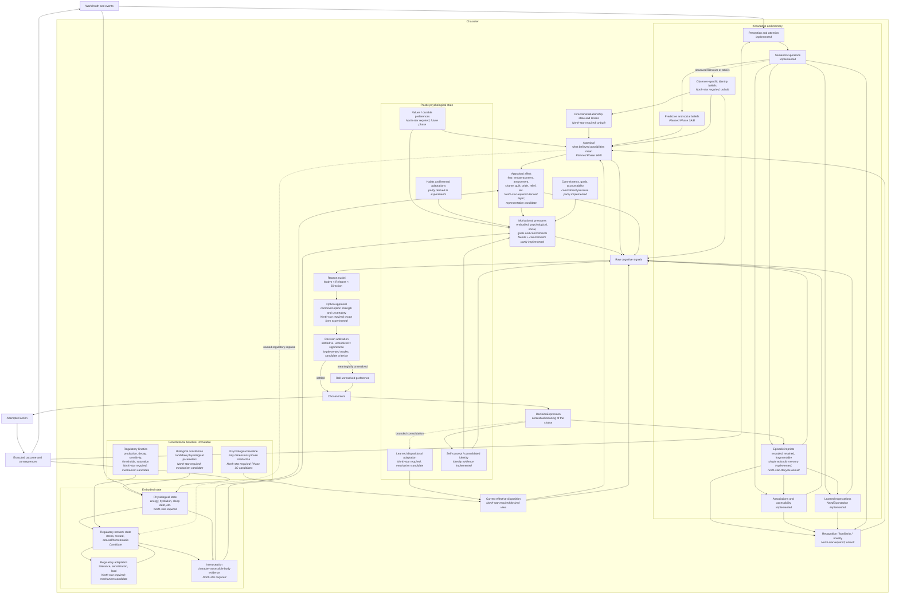

The core interpretation is:

> **Constitution supplies baselines. Body and regulation change. Perception becomes character-relative evidence; memory, recognition, belief, appraisal, and affect turn evidence into meaning. Motivations compile into reasons; option appraisal and arbitration determine whether uncertainty remains. Intent produces both attempted action and frozen autobiographical expression. Repeated history consolidates into future structure without rewriting the past.**

This is a causal network, not a per-frame pipeline. Every feedback loop requires explicit deterministic event ordering.

---

## 3. What exists now: Phase 2.97

The currently implemented character state is narrower than the full conceptual character.

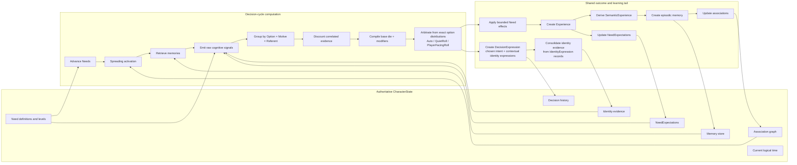

Important current boundaries:

1. `CharacterState` does **not** yet contain latent personality or predictive beliefs.
2. `SemanticExperience` is the character-relative boundary downstream cognition should consume. It excludes simulator-omniscient `Overflow` by design.
3. Need pressure and commitment pressure are independent `MotiveGenerating` families. This is a valuable open-family precedent for future motive sources.
4. Identity, memory-derived evidence, and other modifiers cannot create a Reason Nucleus when no motive-generating base exists.
5. Chosen intent and executed outcome are distinct, preserving authorship when an external force changes execution.
6. Identity updates already pass through a contextual `DecisionExpression` containing `IdentityExpressionRecord`s; a bare Action or intent does not directly mutate identity.
7. Decision resolution already computes `Margin`, `Contest`, `Stake`, and `AuthorshipPotential` and selects `Auto`, `QuietRoll`, or `PlayerFacingRoll`. Research may revise the arbitration meaning, but dice are not literally mandatory for every resolved Decision today.
8. The generic `EvidentialEstimate` extraction has begun in the working tree, but Phase 3 belief and relief stores are not implemented.
9. Current episodic memories and `decisionHistory` are unbounded rich records. They are valid research instrumentation, but they do not implement North Star imprint fragmentation, recognition, recollection, or progressive historical compression.
10. Current identity is self-directed evidence only. Observer-relative identity belief, sparse directional relationship state, and multidimensional relationship appraisal are not implemented.
11. Current Reason Nuclei compile directly into option distributions; the North Star's explicit Option Appraisal seam is not yet a separately named model boundary.

---

## 4. Planned Phase 3 extension

Phase 3 adds prediction, appraisal, social inference, and constitutional personality without replacing the existing signal compiler.

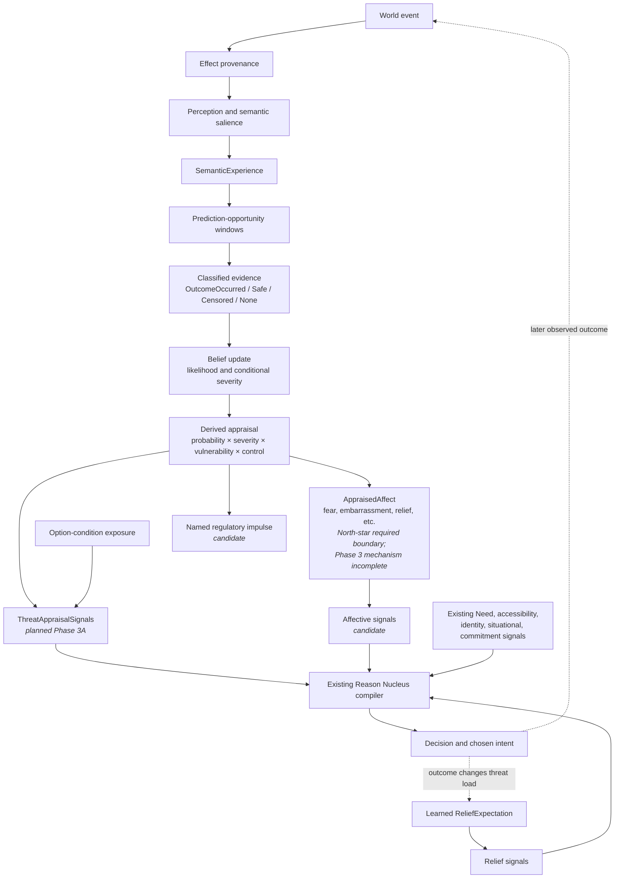

Phase 3 and the candidate affect layer preserve six separations:

- World truth is not perception.
- Perception is not belief.
- Belief is not appraisal.
- Appraisal is not affect.
- Affect is not a regulatory concentration.
- Affect and appraisal can generate motives or impulses, but neither is a command.

`ThreatStrength`, regulatory activation, experienced fear, and an Avoid reason therefore remain related but non-identical quantities. General `AppraisedAffect` is a candidate architectural family; only specific fear/relief quantities are planned by the current Phase 3 brief.

North Star correction to Phase 3C: the seven inherited personality dimensions are candidates, not protected ontology. Phase 3 experiments may use them as competing models, but the architecture must attempt to eliminate any dimension reproducible from body, regulation, memory, belief, affect, recognition, social history, identity, or their interactions.

---

## 5. Memory, recognition, social inference, and consolidation

The North Star expands “episodic memory” into a lifecycle and makes recognition a separate computation. This target view is not implemented by the current `MemoryStore`.

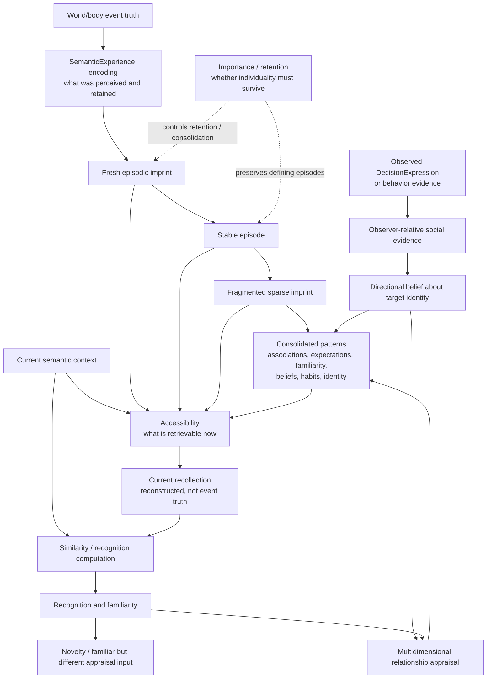

Three quantities must not collapse:

- **Importance/retention:** should this episode remain individuated?
- **Accessibility:** how readily does current context retrieve it?
- **Recognition:** how strongly does the present match surviving memory?

The universal consolidation rule is:

> Retain historical detail while its individuality remains causally or explanatorily important. Otherwise consolidate its future contribution into compact learned state, without deleting provenance still needed for behavior or historical explanation.

This creates an explicit target mismatch with the current research implementation: `MemoryStore` and `decisionHistory` are intentionally unbounded and preserve rich records. That is acceptable for small-cast experimentation, but not North-Star-complete and not a Vivarium production model.

---

## 6. Candidate regulatory subsystem

### 5.1 Recommended internal structure

Do not model a “Stress Reactivity” value or a “Dopamine” value. Model a system with immutable kinetics and dynamic state, then derive behavioral summaries.

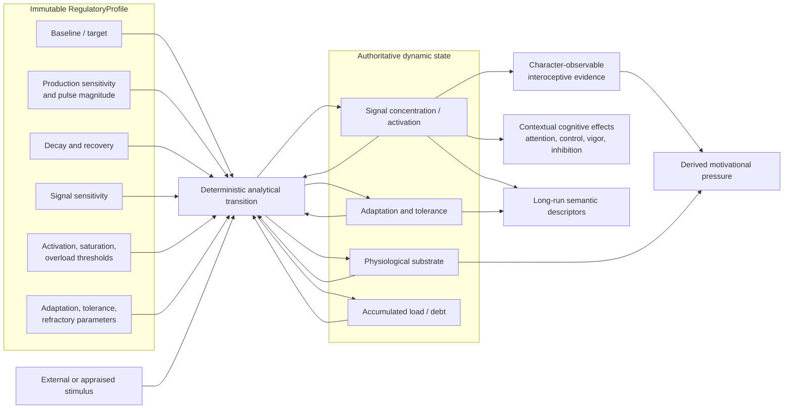

Start with three abstract axes:

1. **Stress** — threat-triggered activation, recovery, stacking, overload, adaptation.
2. **Reward** — reward prediction response, reinforcement vigor, adaptation/tolerance, deficit after repeated exposure.
3. **Arousal/Homeostasis** — alertness and activation interacting with sleep pressure and stress.

Do not initially name these after literal hormones. Biological names imply fidelity that the research model has not earned.

“Axis” is an experimental entry point, not a claim of independence. The durable abstraction should permit a small regulatory network in which stress changes arousal or reward sensitivity, sleep debt changes stress sensitivity, and arousal changes later threat weighting. Gate 1 should still isolate one stress axis so cross-effects are added only when an experiment requires them.

### 5.2 State ownership

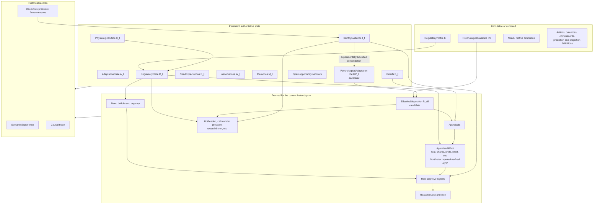

This prevents three common modeling errors:

- persisting a trait label that can be recomputed;
- treating a fleeting concentration as constitution;
- treating an immutable kinetic parameter as momentary state.

It also prevents identity evidence, psychological adaptation, and effective disposition from becoming aliases. Identity says what meaningful choices have expressed; adaptation is a candidate causal update to bounded psychological contributors; effective disposition is the current derived result. The arrow from identity consolidation to adaptation must be experimentally earned and must not count the same expression twice as both identity pressure and adapted personality pressure.

### 5.3 The critical feedback loop

The candidate design is not a one-way endocrine pipeline. Believed threats can trigger regulation, and regulatory state can alter later appraisal and action. That creates a loop which must be broken by explicit event ordering.

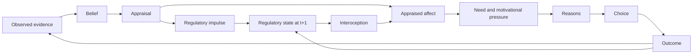

The arrow from appraisal to regulatory state must be a named transition or impulse, not an instantaneous circular read. Otherwise “stress raises vulnerability, which raises threat, which raises stress” has no deterministic evaluation order.

---

## 7. Recommended cycle ordering after the redesign

This sequence is a research candidate. It resolves the new feedback loop without letting a current-cycle value recursively rewrite itself.

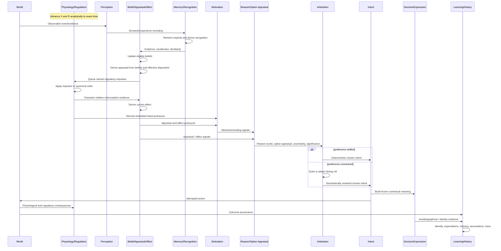

Two event paths may ultimately be clearer than one overloaded cycle:

- **World-observation path:** something happens to or around the character, producing evidence, appraisal, and possibly regulatory impulses.
- **Decision path:** current state is compiled into reasons, intent is chosen, and an outcome is applied.

CharacterLab can keep one orchestrator initially, but the trace should name these phases separately.

---

## 8. Architectural impact assessment

### 8.1 What should remain unchanged

- Exact rational arithmetic, canonical ordering, counter-addressed randomness, and full causal traces.
- World truth → character-relative `SemanticExperience` boundary.
- Belief/appraisal/motive separation.
- Appraisal, affect, interoception, and regulatory state as distinct causal meanings.
- `RawCognitiveSignal` and Reason Nucleus compilation as the common downstream interface.
- Decision arbitration as the boundary that determines whether a roll is required.
- Chosen intent versus executed outcome separation.
- `DecisionExpression` as the contextual boundary between chosen intent and identity evidence.
- Acquired identity as evidence accumulated from meaningful expressions.
- Learned beliefs, expectations, social knowledge, identity, and affect as semantic constructs rather than regulator aliases.
- Historical reasons and expression provenance as frozen facts that later change cannot rewrite.
- No hidden semantic oracle: authored world facts may enter the model, but every character-relative transformation must be deterministic.

### 8.2 What probably changes

| Existing area | Likely redesign |
| --- | --- |
| `CharacterState` | Add immutable biological/psychological/regulatory baselines; add dynamic physiology, regulation, regulator adaptation, plastic disposition, values, habits, self-concept, beliefs, sparse social state, and opportunity state as experiments earn their representations. |
| `advanceAllNeeds` | Become or follow an analytical physiology/regulation advancement step. Some Need values become derived projections rather than independently advanced stores. |
| `NeedDef` / `NeedState` | Split “resource/store state” from “motivational pressure.” Retain direct psychological Needs where no physiological derivation is justified. |
| `WorldOutcomeTable` | Support typed effects on physiology, regulatory impulses, and ordinary world state rather than only direct Need deltas. |
| `Experience` | Record bodily/interoceptive observations without exposing simulator-only internal facts the character could not sense. |
| `SemanticExperience` | Extend with a character-relative interoceptive projection, not raw regulator concentrations by default. |
| `NeedExpectation` | Clarify whether it predicts immediate relief, delayed regulatory effect, or both. A single immediate delta may be insufficient for delayed effects. |
| Phase 3 appraisal | Permit appraisal to emit a regulatory impulse while keeping appraisal trace-only; introduce a general derived Affect family only if cross-emotion experiments justify it. |
| Decision resolution | Preserve current analytical arbitration, but test settled-vs-unresolved preference and significance as the principled reason for `Auto`, `QuietRoll`, and `PlayerFacingRoll`. |
| Identity | Preserve `DecisionExpression` as the evidence boundary; test whether repeated cross-context identity consolidation produces bounded psychological adaptation without double-counting identity as a second standing pressure. |
| Memory | Replace indefinite rich-episode retention as the target with encoded imprints, distinct retention/accessibility/recognition, reconstruction, and progressive consolidation. Keep rich current records as research instrumentation until the lifecycle is tested. |
| Recognition | Add a deterministic comparison seam between current `SemanticExperience`, retrieved imprints, and consolidated patterns; do not equate recognition with accessibility. |
| Social model | Add observer-relative evidence, directional identity beliefs, sparse relationship state, and multidimensional appraisal lenses. Observers never read target constitution or private intent directly. |
| Decisions | Name Option Appraisal between Reason compilation and Arbitration; ensure chosen intent independently produces attempted action and frozen `DecisionExpression`. |
| History | Add retention/compaction policy that preserves defining episodes and frozen explanations while consolidating routine causal contribution. |
| Goals/accountability | Generalize the open `MotiveGenerating` family beyond Needs and static commitments while preserving observer attribution and intent/execution separation. |
| Status effects | Become perturbation packages over regulatory/physiological transitions plus explicit impairments, not bags of personality-stat modifiers. |
| Addiction | Move from “instantiate a withdrawal Need at threshold” toward reward adaptation, baseline shift, tolerance, deficit, craving pressure, and learned prioritization. |
| Diagnostics | Derive stress reactivity, recovery, thrill-seeking, calmness, and addiction vulnerability over an explicit observation window. |

### 8.3 What must not happen

- A regulator directly becomes a generic aggression, fear, sociability, or pleasure meter.
- Regulatory state silently manufactures belief evidence.
- Personality and regulatory effects are both counted as separate modifiers when one was already used to derive the other.
- One fact is counted through regulator → affect → motive and again as a direct option penalty or duplicate personality modifier.
- A character reads simulator-omniscient concentrations or overflow unless an interoceptive observation model makes them available.
- A modifier creates a motive from zero merely because a regulator is high.
- A bare Action or intent token updates identity without contextual `DecisionExpression` semantics.
- Identity consolidation mutates the immutable baseline, or psychological adaptation is assumed merely because a semantic trait was recognized.
- Every Decision is rolled despite a settled preference, or “unresolved” is guessed from close dice without an explicit analytical definition.
- Current appraisal and current regulator values recursively update each other without an explicit phase boundary.
- CharacterLab adopts literal biological terminology before validating the abstraction's behavioral value.
- Accessibility, importance/retention, recognition, familiarity, and affection collapse into one memory or relationship strength.
- Rich episodic and decision records grow forever in the production target merely because CharacterLab retains them for inspection.
- An observer reads another character's effective disposition, self-identity, private intent, or hidden cause without perceived evidence.
- A semantic trait, affect, similarity judgment, or DecisionExpression qualifier depends on manual/LLM interpretation inside the authoritative loop.

---

## 9. Proposed type boundary

The names below are conceptual, not an implementation mandate.

```text
CharacterConstitution
├── BiologicalConstitution
│   └── candidate physiological parameter families
├── PsychologicalBaseline
│   └── only experimentally retained dimensions
│       // Phase 3C candidates: Warmth, Agency, Stability,
│       // Sociability, Openness, Discipline, Attunement
└── RegulatoryConstitution
    ├── stress: RegulatoryAxisParams
    ├── reward: RegulatoryAxisParams
    └── arousalHomeostasis: RegulatoryAxisParams

PsychologicalState
├── adaptation: Map<PersonalityDimension, Rational>  // candidate, bounded
└── effectiveDisposition = project(baseline, adaptation, current context)  // derived

BiographicalState
├── identityEvidence: Map<IdentityExpressionChannelId, IdentityEvidenceState>
├── retainedDecisionExpressions: DecisionExpression[]
├── consolidated autobiographical structure
└── retention / preservation provenance

EmbodiedState
├── physiological: Map<PhysiologicalVariableId, Rational>
├── regulatory: Map<RegulatoryAxisId, RegulatoryAxisState>
└── adaptation: Map<AdaptationTargetId, AdaptationState>

RegulatoryAxisParams
├── target / baseline
├── productionSensitivity
├── pulseMagnitude
├── decayRate
├── responseSensitivity
├── activationThreshold
├── saturationThreshold
├── overloadThreshold
├── refractoryDuration
└── adaptationRate

RegulatoryAxisState
├── level
├── accumulatedLoad
├── tolerance
├── refractoryUntil
└── lastUpdatedAt

DecisionArbitration
├── analytical option distributions
├── settledness / unresolvedness measure  // candidate refinement
├── significance measure
└── mode: Auto | QuietRoll | PlayerFacingRoll

DecisionExpression
├── chosenIntent
├── considered alternatives
├── supporting and opposing reasons
├── contest / cost / significance context
├── intervention and execution provenance
└── IdentityExpressionRecord[]
```

Keep baselines, plastic state, and derived effective disposition separate. Likewise, keep regulatory parameter definitions separate from runtime state so two characters can have equal current levels and different future trajectories. `RegulatoryAxisParams` may later become nodes and edges in a coupled `RegulatoryNetworkDef`; the initial axis-shaped API must not preclude that evolution.

---

## 10. CharacterLab → Vivarium mapping

CharacterLab should export **semantic findings and tested transition contracts**, not its TypeScript object graph.

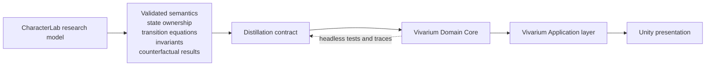

Vivarium-specific constraints that the distilled character model must preserve:

- The authoritative model belongs in pure C# Domain code, never Unity.
- The target should remain compatible with approximately 10,000 simulated characters, even though CharacterLab experiments use a tiny cast.
- Continuous regulation and cognition should advance analytically or by scheduled meaningful crossings, not per-character/per-frame ticking.
- State that affects continuation must persist; derived indexes and descriptors should rebuild.
- Social/relationship state must be sparse and directional; never materialize universal N×N matrices.
- Memory retrieval must be indexed and bounded; routine history must progressively consolidate instead of accumulating rich episodes forever.
- Character knowledge, player knowledge, world truth, and presentation remain distinct.
- Living Decisions reevaluate through targeted dependencies rather than global polling.
- Historical reasons describe the state at decision time and are never recomputed from the later world.
- No LLM or manual semantic judgment may bridge authoritative internal layers; content supplies world semantics, while the model computes character-relative meaning.
- CharacterLab Reason Nuclei and Vivarium Considerations/ReasonChannels are semantic cousins, not identical structures. Distillation should map tested causal roles rather than port names one-for-one.

---

## 11. North-Star roadmap reconciliation

The original phase sequence was organized around the capabilities known when the deterministic reference brief was written. Its governing method was constructive minimalism: begin with a small model and add a mechanism when a missing behavior demands one. The North Star exposes the failure mode of that approach for a causally deep character: each newly discovered upstream layer can reinterpret several already-built downstream mechanisms.

CharacterLab should now use **reference-first subtractive refinement**:

1. represent the complete North-Star causal topology;
2. give every seam a thin deterministic contract, replaceable mechanism, and causal trace;
3. run an intact reference model across a retained phenomenon corpus;
4. remove, derive, merge, compress, or substitute one candidate distinction;
5. accept the simplification only if behavioral and causal equivalence survives.

This is a complete **topology** first, not a complete high-fidelity implementation first. Research depth should still proceed by dependency and invalidation risk, but no downstream layer should need to be invented later merely to have a place in the model. Required phenomena and invariants—not agreement with the reference model for its own sake—remain the authority; a failing reference mechanism must be revised or substituted before it can be a useful ablation baseline.

### 11.1 Proof-status map

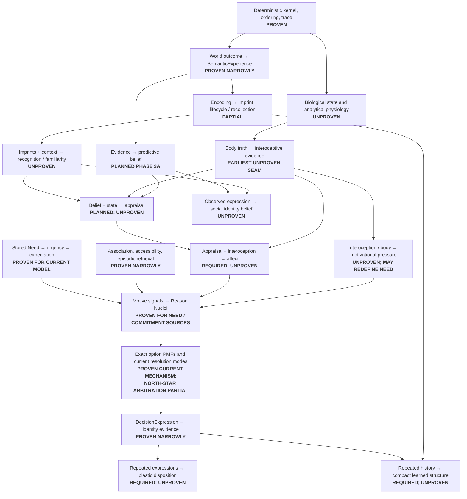

### 11.2 Seam ledger

| Causal seam | Evidence today | Verdict |
| --- | --- | --- |
| Exact state/input/seed → reproducible transition and trace | Kernel proofs and 328 passing tests | **PROVEN** |
| World outcome → bounded effect → character-relative `SemanticExperience` | Phases 2.5a–e | **PROVEN NARROWLY** |
| Stored Need level → deficit/urgency → choice pressure | Phase 1 and later regressions | **PROVEN FOR THE CURRENT STORED-METER MODEL** |
| Experience → association/accessibility and rich episodic record | Phase 2/2.5 | **PROVEN NARROWLY; NOT NORTH-STAR MEMORY LIFECYCLE** |
| Need/commitment pressure → independent Reason Nuclei | Phase 2.97 | **PROVEN FOR CURRENT SOURCE FAMILIES** |
| Reasons → exact PMFs → Auto/Quiet/Player-facing modes | Phase 2.9–2.97 | **CURRENT MECHANISM PROVEN; SETTLEDNESS/SIGNIFICANCE INTERPRETATION PARTIAL** |
| Chosen intent → contextual expression → identity evidence | Phase 2.9–2.97 | **PROVEN NARROWLY** |
| Biological constitution → changing physiological state | None | **UNPROVEN** |
| Body truth → legitimate interoceptive evidence | None | **UNPROVEN — EARLIEST CHARACTER-RELATIVE SEAM** |
| Interoception/physiology → Need or motivational pressure | Current model starts after this boundary | **UNPROVEN — REPRESENTATION-INVALIDATING** |
| Encoding → imprint fragmentation/consolidation → recollection | Rich `MemoryEpisode` only | **PARTIAL / UNPROVEN** |
| Current context + imprints → recognition/familiarity/novelty | None | **UNPROVEN** |
| Classified evidence → predictive/social belief | Generic estimate math only | **PLANNED, NOT PROVEN** |
| Belief + state → appraisal → Affect | Phase 3 formulas/plans only | **PLANNED, NOT PROVEN** |
| Observed expression → observer identity belief → relationship appraisal | None end-to-end | **UNPROVEN** |
| Repeated expressions → bounded dispositional adaptation → shifted uncertainty boundary | Identity feedback only | **UNPROVEN** |
| Routine history → compact structure with retained necessary provenance | None | **UNPROVEN** |

### 11.3 Earliest unproven seam—and its revised role

The first North-Star seam CharacterLab has not actually demonstrated is:

> **Body truth → character-accessible interoceptive evidence → motivational pressure.**

The current model begins downstream with a stored `NeedState.Level`, advances it directly, applies Action outcomes directly to it, and learns `NeedExpectation` from its immediate delta. That proves a coherent stored-meter model. It does **not** prove:

- what bodily state exists beneath Hunger, Thirst, Sleep, pain, arousal, or stress;
- which internal facts the character can legitimately sense;
- whether Need is authoritative state or a derived pressure;
- whether an outcome changes physiology, sensation, motivation, or all three at different times;
- what `NeedExpectation` should predict when consequences are delayed or regulator-mediated.

This seam precedes predictive belief in causal dependency and has unusually high invalidation risk. Under the former additive roadmap, that made it the next architecture-defining gate. Under reference-first refinement, it instead becomes the **first deep reduction campaign after the full causal scaffold exists**.

That distinction matters. CharacterLab should not deeply solve body and motivation while memory, recognition, appraisal, affect, social belief, expression, identity, and consolidation remain absent from the executable topology. Doing so could optimize the seam against another incomplete downstream target. The thin reference scaffold first establishes what the seam must connect to; the embodied campaign then determines which internal distinctions it actually needs.

### 11.4 Recommended next research gate

Replace the existing Phase 3 sequence with a North-Star foundation:

> **North-Star Reference Scaffold**

Build the thinnest deterministic end-to-end model that crosses every required causal family:

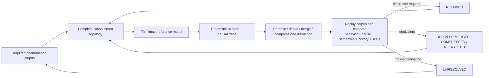

The scaffold must include explicit, independently traceable boundaries for:

```text
constitution → body / regulation → interoception
→ perception / semantic experience → memory / recognition
→ predictive and social belief → appraisal → affect
→ motivation → reasons → option appraisal / arbitration
→ intent → expression / execution → outcome
→ autobiographical, relational, and dispositional consolidation
```

Each boundary needs at least one deterministic reference implementation, but uncertain mechanisms should be intentionally simple. A placeholder is legitimate only when it preserves the seam's inputs, outputs, epistemic limits, provenance, timing, and substitution point. A pass-through that silently collapses two disputed concepts is not a scaffold.

The first vertical scenarios should collectively exercise embodiment, delayed consequences, imperfect memory, recognition, observer-relative evidence, meaningful choice, intent/execution separation, and identity feedback. They need not yet reproduce the full torture corpus. Their purpose is to prove that the architecture is traversable, traceable, and experimentally replaceable end to end.

Once this scaffold is operational, begin the first reduction campaign:

> **Embodied Motivation and Need Ownership**

Start with one ordinary body-regulated domain—preferably hydration or sleep—and compare:

1. **Model A: stored Need meter** — the current canonical control.
2. **Model B: body state → directly derived pressure.**
3. **Model C: body state → interoceptive evidence → derived pressure.**
4. **Model D: body state → minimal regulator → interoception → pressure**, built only if A–C leave a demonstrated gap.

Required discriminating tests:

- identical body truth with different interoceptive constitution produces traceably different experienced pressure;
- identical interoceptive evidence produces identical pressure even when hidden simulator-only body detail differs, proving no truth leak;
- action effects target their honest causal substrate and produce downstream motivation in explicit order;
- continuous state advances analytically across short, long, and offline-equivalent intervals;
- current saturation/censored-learning findings are re-baselined rather than assumed to survive;
- `NeedExpectation` is classified as predicting immediate relief, delayed bodily effect, expected motivational change, or separate quantities;
- body state, interoception, Need pressure, appraisal, and regulatory effects cannot contribute duplicate equivalent reasons;
- replay, trace, and invariants remain exact.

The gate must classify Need ownership as **stored**, **derived**, or **hybrid**, and classify a regulatory layer as **required now** or **deferred until a simpler model fails**.

### 11.5 Revised research sequence

Only the reference scaffold and the first high-risk campaign should be treated as locked. Later campaigns should be reordered when cross-seam evidence changes their discriminating value:

```text
COMPLETED FOUNDATION
Phases 0–2.97
        ↓
FREEZE RETAINED PHENOMENA + CONTROL IMPLEMENTATIONS
        ↓
NORTH-STAR REFERENCE SCAFFOLD
complete seams, thin mechanisms, end-to-end trace
        ↓
INTACT REFERENCE CORPUS
ordinary + embodied + social + autobiographical scenarios
        ↓
FIRST REDUCTION CAMPAIGN
Embodied Motivation and Need Ownership
        ↓
RISK-ORDERED REDUCTION CAMPAIGNS
belief / appraisal / affect
memory / recognition / consolidation
social identity / relationships
constitution / plastic disposition
option appraisal / arbitration / roll boundary
values / goals / addiction
        ↓
VIVARIUM DISTILLATION
only earned distinctions and measured production contracts
```

Every campaign starts with the intact reference path and changes one causal distinction at a time. Existing phases become evidence packages and control implementations, not architectural eras that later work must extend.

### 11.6 Disposition of current Phase 3 work

Do **not** revert it wholesale now.

- Keep `estimate.ts` and the thin `expectation.ts` aliases: this is a behavior-neutral generic extraction, all **328 tests pass**, and the abstraction is useful whether the next learned estimate concerns Need relief, body effect, belief, severity, or recognition.
- Keep the Phase 3 research brief and implementation plan as hypothesis sources, but stop treating their A→B→C order as the active roadmap. Their candidate mechanisms may populate parts of the reference scaffold and later reduction campaigns.
- Rebase Phase 3A later: prediction-opportunity and belief semantics are likely salvageable; direct `ThreatAppraisal → signal` flow must be reconciled with required Affect/interoception/regulatory boundaries.
- Rework Phase 3B around recognition, observer-relative identity evidence, sparse directional state, and relationship lenses rather than only reusing one generic belief map by assumption.
- Replace Phase 3C's fixed seven-dimensional delivery plan with primitive-falsification experiments. Warmth, Agency, Stability, Sociability, Openness, Discipline, and Attunement are candidate baselines, not a required final vector.

No current Phase 3 behavioral mechanism exists to roll back: the worktree contains the generic estimate refactor plus planning documents, not belief/appraisal/personality runtime modules.

### 11.7 Ground-zero option and salvage boundary

The North Star authorizes a ground-zero reconsideration of **every character primitive**. It does not require discarding contracts already demonstrated independently of those primitives.

| Disposition | Existing work | Reason |
| --- | --- | --- |
| **Preserve as earned substrate** | Exact rational/lattice kernel, canonical identity and ordering, counter-addressed RNG, state/trace hashing, deterministic event identity, invariant harness | These solve proof obligations rather than assuming a particular psychology. |
| **Preserve as earned semantic boundaries** | World truth versus character-relative `SemanticExperience`; evidence-kind/provenance distinctions; intent versus execution; frozen historical explanation | The North Star explicitly requires these separations even if their current record shapes later change. |
| **Preserve but keep falsifiable** | Generic `EvidentialEstimate`; `EvidenceBasis` correlation consolidator; Raw Cognitive Signal / Reason Nucleus compiler; exact option distributions | Each is useful and tested, but future experiments may refine where it is used or prove a more general representation necessary. |
| **Reopen immediately** | Stored Need meter, `advanceAllNeeds`, direct outcome→Need effects, NeedExpectation target semantics, body/interoception absence | These sit directly on the earliest unproven seam. |
| **Reopen before their next build phase** | Rich unbounded memory, recognition absence, current arbitration meaning, identity→adaptation bridge, seven-dimensional `P`, direct appraisal→signal design | The North Star changes their target obligations. |
| **Retire as roadmap authority, retain as historical hypotheses** | Original Phase 3 A→B→C scheduling and fixed deliverable list | Useful experimental material, but no longer valid dependency ordering without rebasing. |

Recommended strategy: **architectural refoundation, not repository amnesia**.

Start the next research question from the North Star as though no character primitive is sacred. Reuse a current mechanism only when it is an explicit competing model or an independently proven utility. Preserve old implementations under named control paths until counterfactual experiments classify them; do not delete them merely to make the new model look clean.

A full implementation restart becomes justified only if building the North-Star reference scaffold demonstrates one of these conditions:

1. exact/canonical infrastructure cannot express or analytically advance the required dynamics;
2. `SemanticExperience` cannot extend to interoception without leaking body truth;
3. the current signal/nucleus contract necessarily double-counts embodied, affective, or learned causes;
4. the cycle orchestrator cannot be separated into deterministic event phases without pervasive semantic coupling;
5. most existing behavioral tests assert obsolete representations rather than retained North-Star capabilities, making controlled re-baselining less informative than a clean harness.

Until one of those conditions is observed, deleting the proven substrate would sacrifice controls and earned contracts without reducing the central uncertainty.

---

## 12. First reduction campaign: embodied regulation and motivation

This campaign begins only after the North-Star Reference Scaffold can traverse and trace the relevant downstream seams with thin reference mechanisms.

### Gate 0 — protect the baseline

Freeze a small set of Phase 2.97 and Phase 3 experiments as comparison scenarios. The candidate branch must show exactly which old findings survive, refine, or fail.

### Gate 1 — one stress axis

Implement only an abstract stress regulator and test:

- same threat, different rise/recovery kinetics;
- repeated threat stacking;
- equal current level, different future trajectories;
- threat sensitivity (classification) versus stress reactivity (response) separation;
- “calm under pressure” as a multi-cause diagnostic rather than a primitive;
- deterministic replay across long idle intervals.

### Gate 2 — motive integration

Compare three models:

1. regulator directly modifies appraisal;
2. regulator derives Need/motivational pressure;
3. regulator contributes a context-modulating signal only when a motive already exists.

Reject any model that double-counts the same regulatory fact or lets it manufacture unrelated motives.

The North Star promotes this beyond the regulatory experiment to a general invariant:

> One causal fact may have several downstream consequences, but it may contribute to one Decision through multiple paths only when those paths represent independently meaningful effects. Derivation provenance must make accidental duplicate pressure detectable.

### Gate 3 — reward adaptation

Add one abstract reward axis and test reinforcement, tolerance, baseline shift, absence deficit, and craving. Compare against the current acquired-withdrawal-Need proposal.

### Gate 4 — status-effect perturbation

Model one “intoxication-like” perturbation and verify that different constitutions produce different behavior without authored per-character outcome scripts.

### Gate 5 — Vivarium production obligations

Measure:

- analytical advancement cost;
- scheduled threshold/crossing count;
- persistence footprint;
- dependency invalidation breadth;
- trace size;
- population-scale behavior under headless simulation.

Only then decide whether the regulatory model replaces, supplements, or merely parameterizes existing Needs and Phase 3 constitution.

### Parallel Gate A — affect family

Implement fear first using separate threat appraisal, regulatory activation, interoception, experienced affect, and motive outputs. Then test embarrassment or amusement—an affect with no necessary stress-axis interpretation. Generalize to `AppraisedAffect` only if the shared state/transition shape explains both without erasing their differences.

### Parallel Gate B — arbitration semantics

Use the existing `Margin`, `Contest`, `Stake`, `AuthorshipPotential`, exact PMFs, and three resolution modes as the baseline. Compare them with a candidate settledness × significance model. Require cases where a strong settled preference auto-resolves, a low-significance unresolved preference rolls quietly, and a high-significance unresolved preference becomes player-facing.

### Parallel Gate C — psychological adaptation

Start with immutable Phase 3C `P` and existing acquired identity. Add no adaptation until repeated meaningful `DecisionExpression`s demonstrate behavior identity feedback alone cannot explain. If added, update only explicit causal contributors, bound total deviation from baseline, retain provenance, test reversal/recovery, and ablate the identity standing signal to detect double-counting.

---

## 13. Open design decisions

1. **Need semantics:** Are Hunger, Thirst, and Sleep persistent state, derived motivational projections, or named views over several underlying variables?
2. **Interoception:** What internal facts can the character actually observe, and with what precision?
3. **Time-lagged learning:** Does an action earn credit for delayed physiological/regulatory consequences, and how is that credit assigned?
4. **Appraisal coupling:** Does threat appraisal create an immediate regulatory impulse before a decision, or only influence the next event boundary?
5. **Baseline and adaptation:** Does `P` continue to mean the immutable Phase 3C baseline, with `ΔP` as separately bounded adaptation and `P_eff` derived? What evidence earns an adaptation update rather than identity feedback alone?
6. **Motivational adapter:** Which regulator effects create Need pressure, which modulate existing pressure, and which affect only execution/performance?
7. **Status-effect scope:** Which effects are regulatory perturbations versus direct motor, perceptual, or memory impairments?
8. **Diagnostic window:** Over what controlled history may the system call someone stress-reactive, thrill-seeking, or addiction-prone?
9. **Production scheduling:** Which regulator dynamics have closed-form analytical advancement, and which require scheduled phase changes?
10. **Migration:** Can existing direct Need effects remain as an explicit legacy/control path while regulatory effects are introduced experimentally?
11. **Expression sufficiency:** Which contextual fields make a `DecisionExpression` legitimate identity evidence, and how are trivial, coerced, or intervention-distorted choices excluded or discounted?
12. **Arbitration:** What exact quantity means “settled preference,” how does it differ from probability margin, and how does significance choose Auto versus quiet/player-facing presentation?
13. **Affect representation:** Is Affect purely trace state, does any affect require persistence, and which affects depend on interoception versus appraisal alone?
14. **Adaptation double-counting:** If identity consolidation changes effective disposition, when should identity cease or continue contributing its standing signal to the same motive?
15. **Cross-regulation:** When do experiments justify replacing independent-axis transitions with a coupled regulatory network?

---

## 14. Primary recommendation

Adopt this as the working hypothesis:

> A character has immutable constitutional baselines, plastic psychological state, dynamic embodied state, character-relative knowledge and memory, and biographical identity. Baseline plus learned dispositional adaptation yields current effective disposition. Perception, recognition, belief, context, disposition, and interoception produce appraisal and affect; these contribute to motivations and independent reasons. Option appraisal and arbitration roll only where meaningful uncertainty remains. Chosen intent independently produces attempted action and contextual `DecisionExpression`; repeated history consolidates into future structure without rewriting the past.

Implement that hypothesis first as an intentionally overcomplete, thin, end-to-end reference model. Then simplify by controlled ablation and substitution. Preserve a distinction when removing it destroys a required behavior or causal counterfactual; otherwise derive, merge, compress, or retract it. “Minimal” means the smallest architecture demonstrated equivalent across the retained phenomenon corpus, not the smallest model chosen before the experiments begin.

Do **not** protect the seven inherited psychological dimensions from falsification, fold regulatory kinetics into them, mutate constitutional baselines, equate affect with regulatory concentration, collapse memory accessibility into recognition, or let bare intent directly author identity. Keep truth, evidence, memory imprint, recollection, recognition, belief, appraisal, affect, motivation, reason, option appraisal, arbitration, intent, expression, execution, and consolidation causally distinct; make each representation experimentally earn its place.

---

## 15. Source anchors

- [CharacterLab — Ideal Character Architecture North Star.md](CharacterLab%20%E2%80%94%20Ideal%20Character%20Architecture%20North%20Star.md) — primary character-model authority, required capabilities, invariants, and proof obligations.
- [README.md](README.md) — implemented scope, deterministic kernel, module map, and canonical modes.
- [CharacterLab — Deterministic Cognitive Reference Model Brief.md](CharacterLab%20%E2%80%94%20Deterministic%20Cognitive%20Reference%20Model%20Brief.md) — original state model, Needs, full cycle, acquired Needs, and research rules.
- [CharacterLab — Phase 2.5 Research Brief.md](CharacterLab%20%E2%80%94%20Phase%202.5%20Research%20Brief.md) — world/perception/experience boundary and saturation semantics.
- [CharacterLab — Phase 2.97 Research Brief.md](CharacterLab%20%E2%80%94%20Phase%202.97%20Research%20Brief.md) — Reason Nuclei, source roles, correlation handling, and dice compilation.
- [CharacterLab — Phase 3 Research Brief.md](CharacterLab%20%E2%80%94%20Phase%203%20Research%20Brief.md) — planned belief, appraisal, social inference, and constitution.
- [CharacterLab — Phase 3 Implementation Plan.md](CharacterLab%20%E2%80%94%20Phase%203%20Implementation%20Plan.md) — proposed Phase 3 module boundaries and build order.
- [`reference/src/model/character.ts`](reference/src/model/character.ts), [`reference/src/model/cycle.ts`](reference/src/model/cycle.ts), [`reference/src/model/semanticExperience.ts`](reference/src/model/semanticExperience.ts), [`reference/src/model/reasonNucleus.ts`](reference/src/model/reasonNucleus.ts), and [`reference/src/model/diceCompiler.ts`](reference/src/model/diceCompiler.ts) — preserved pre-refoundation control implementation.
- Vivarium sister repository: `Docs/Architecture.md`, `Docs/Architecture/Reference.md`, `Docs/Design/DecisionReasoning.md`, and `Docs/ImplementationStatus.md` — production constraints and current implementation shape.
