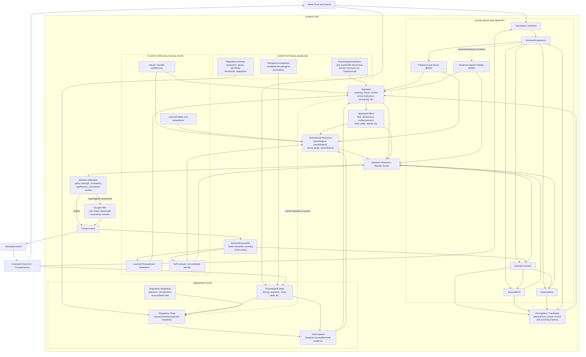

# CharacterLab — Ideal Character Architecture North Star

**Status:** Architectural ground truth  
**Authority:** Primary character-model source  
**Scope:** CharacterLab research and eventual Vivarium character-model distillation  
**Purpose:** Define the target architecture, retained invariants, proof obligations, and research boundaries beneath which all CharacterLab phase briefs, experiments, implementation plans, and redesign proposals operate.

---

## 1. Authority and purpose

This document defines **what CharacterLab is attempting to prove can exist**.

It is the primary architectural source for the character model.

Lower-level documents remain authoritative for:

- the behavior currently implemented;
- the exact methodology of an experiment;
- phase-specific hypotheses;
- accepted experimental findings;
- implementation details of the current research substrate.

However, when a lower-level document makes an architectural assumption that conflicts with this North Star, **this document governs the intended direction**.

This document does not declare every proposed mechanism below to be proven.

It deliberately distinguishes:

1. **Architectural invariants** — properties the eventual model must preserve.
2. **Retained capabilities** — phenomena inherited from Vivarium that the eventual model must explain.
3. **Candidate mechanisms** — proposed ways of satisfying those requirements.
4. **Research obligations** — questions CharacterLab must answer experimentally before a candidate mechanism becomes accepted architecture.

CharacterLab exists specifically so that candidate mechanisms may fail.

The North Star should change only when the desired properties of the simulated character change, or when research proves that two desired properties are fundamentally incompatible.

---

# 2. North-star thesis

The target is not a personality system.

The target is a **deterministic causal model of a person**.

A character should possess:

- constitutional differences;
- a changing body;
- regulatory dynamics;
- perception and attention;
- imperfect knowledge;
- learned expectations;
- memories;
- social beliefs;
- appraisals;
- affective states;
- motivations;
- commitments and goals;
- meaningful decisions;
- genuine uncertainty;
- autobiographical history;
- plastic dispositions;
- relationships;
- and an identity that emerges from how they have lived.

The character must remain autonomous.

The simulation determines conditions.

The character model determines what those conditions mean to that person.

The resulting character chooses according to their current constitution, body, knowledge, history, relationships, motivations, and identity.

The player may influence conditions and, where Vivarium permits, intervene at unresolved boundaries.

The player does not directly author the character's will.

The ultimate product thesis remains:

> **Vivarium is a game about knowing people you cannot control.**

---

# 3. The CharacterLab proof obligation

CharacterLab has one unusually strict architectural requirement:

> **Every authoritative seam in the character model must be expressible deterministically and reducible to semantic meaning through explicit mathematics, without requiring an LLM to determine simulation truth.**

This is not merely an implementation preference.

It is a research objective.

CharacterLab must attempt to demonstrate that:

- perception can be selected deterministically;
- attention and salience can be calculated deterministically;
- memory encoding and retrieval can be calculated deterministically;
- similarity and recognition can be calculated deterministically;
- beliefs can update deterministically;
- uncertainty can be represented mathematically;
- appraisals can be derived deterministically;
- regulatory dynamics can advance deterministically;
- Needs and motivational pressures can be derived deterministically;
- social inference can be updated from evidence deterministically;
- Reasons can be compiled from causal inputs deterministically;
- correlated evidence can be consolidated deterministically;
- option appraisal can be calculated deterministically;
- decision confidence and unresolved conflict can be identified deterministically;
- stochastic resolution, where required, can use deterministic seeded randomness;
- an outcome's semantic Expression can be classified deterministically;
- autobiographical evidence can be accumulated deterministically;
- semantic traits can be recognized deterministically;
- memory can consolidate and fragment deterministically;
- relationships can change deterministically;
- and all of these transitions can produce a complete causal trace.

No LLM may be required to answer:

> “What happened inside this character?”

No LLM may be required to decide:

> “What does this event mean mechanically?”

No LLM may be required to determine:

> “What does this character choose?”

No LLM may be required to decide:

> “What trait has this person earned?”

Language models may eventually be useful outside the authoritative simulation for presentation, natural-language paraphrase, dialogue realization, content-authoring assistance, or other non-authoritative surfaces.

But the underlying semantic truth must already exist before such a model sees it.

The simulation must be capable of running headlessly, reproducibly, explainably, and identically with no language model present.

## 3.1 CharacterLab research posture: reference-first subtractive refinement

CharacterLab does not begin from the fewest mechanisms anyone can imagine and add a new mechanism whenever the current model fails.

That constructive-minimalist strategy is useful for isolated questions, but it is a poor governing method for a causally deep character. A locally sufficient primitive may conceal an upstream layer that later becomes necessary for memory, recognition, social inference, identity, regulation, or long-term adaptation. Repeated discovery of those layers forces downstream work to be reinterpreted.

CharacterLab therefore begins from an intentionally overcomplete **reference architecture** containing the causal distinctions currently believed capable of explaining the ideal character. It then simplifies that architecture experimentally.

The governing target is:

> **The smallest architecture demonstrably equivalent to the ideal reference architecture across the required phenomenon set.**

“Reference architecture” does not mean that every proposed mechanism is accepted, production-ready, or implemented at maximum fidelity. It means:

- the complete end-to-end causal topology is represented from the start;
- every authoritative seam has an explicit contract and trace boundary;
- initially uncertain mechanisms may be deliberately thin, replaceable reference implementations;
- candidate distinctions remain separate long enough to be tested;
- and no candidate earns a place in Vivarium merely because it appeared in the reference model.

CharacterLab should seek **maximum causal legibility before minimum object count**. Prematurely merging perception, memory, recognition, belief, appraisal, affect, regulation, motivation, reasons, decision, expression, and identity would make later failures impossible to localize.

The reference model is a **superset hypothesis**, not a semantic oracle. Required phenomena and architectural invariants judge the model; the model does not define success merely by reproducing its own outputs. If the intact reference path cannot produce a required phenomenon, preserve a truth boundary, or support the needed counterfactual, revise or substitute the responsible candidate before attempting to simplify it.

Every element in the reference architecture belongs to one of three research roles:

1. **Required phenomenon** — a capability the eventual character must preserve, such as imperfect recollection or observer-relative social belief. A phenomenon is a test obligation, not necessarily a subsystem.
2. **Candidate causal distinction** — a proposed seam, state, or transformation that may be necessary to produce one or more required phenomena.
3. **Simplification target** — a candidate distinction deliberately selected for removal, derivation, merger, or compression.

The preferred experiment is therefore often subtractive:

> **If this distinction is removed, merged, derived from lower-level state, or compressed after a transition, does any required behavioral, causal, epistemic, semantic, historical, or scaling property disappear?**

Compare the intact reference model and the reduced model on the same controlled scenario, seed, and retained torture corpus. A simplification is accepted only when the reduced model preserves the required observations **and** the required causal counterfactuals. Similar output alone is insufficient if the reduction destroys provenance, truth boundaries, long-term development, or an important intervention point.

Use this reduction vocabulary consistently:

- **RETAINED** — the distinction survives testing as independently necessary.
- **DERIVED** — the phenomenon survives, but the state or mechanism can be computed from lower-level causes.
- **MERGED** — two candidates are observationally and causally indistinguishable across the current corpus and become one.
- **COMPRESSED** — the distinction is required while learning or interpreting history but can later use a cheaper representation.
- **RETRACTED** — the candidate explains no required distinction and is removed.
- **UNRESOLVED** — current experiments cannot distinguish the competing models.

These are research verdicts, not confidence theater. A verdict must identify the tested corpus and may be reopened when a new required phenomenon supplies a discriminating case.

## 3.2 Deterministic does not mean predetermined

Characters may still roll dice.

A deterministic simulation may contain randomness when that randomness is:

- explicitly invoked;
- counter-addressed or equivalently reproducible;
- scoped to a stable causal identity;
- replayable;
- and part of the trace.

The same authoritative state, inputs, event ordering, and random seed must produce the same result.

---

# 4. Semantic compilation principle

CharacterLab should treat human-readable meaning as something that can be **compiled from causal structure**.

The desired direction is:

```text
quantitative / symbolic state
        ↓
deterministic causal transformations
        ↓
semantic classifications
        ↓
human-readable meaning
```

For example:

```text
high autonomy pressure
+ authority-related context
+ meaningful cost of compliance
+ repeated resistance across contexts
        ↓
qualifying DecisionExpressions
        ↓
identity evidence
        ↓
REBELLIOUS
```

The word `Rebellious` does not create the behavior.

It summarizes a mathematically recognizable historical pattern.

Likewise:

```text
strong anticipated harm
+ high confidence of exposure
+ low perceived control
        ↓
THREAT APPRAISAL
        ↓
FEAR
```

`Fear` is semantic meaning compiled from state.

It is not an authored command to flee.

The goal is not to eliminate semantics.

The goal is to make semantics **earned, causal, inspectable, and reproducible**.

---

# 5. Core architectural invariants

## 5.1 Truth is not Knowledge

Simulator truth must never silently become character knowledge.

A character may only reason from information available through a legitimate causal path.

This applies to:

- world state;
- other characters;
- hidden causes;
- regulatory state;
- memories;
- commitments;
- Observer intervention;
- and the character's own internal processes.

The canonical epistemic separation is:

```text
WORLD / BODY TRUTH
        ↓
observation / interoception
        ↓
CHARACTER EVIDENCE
        ↓
CHARACTER KNOWLEDGE / BELIEF
        ↓
APPRAISAL
```

Unknown must remain distinct from neutral.

Incorrect belief is permitted.

Different observers may infer different people from the same target.

---

## 5.2 Knowledge is not appraisal

Knowing that something happened does not determine what it means to the character.

```text
Knowledge:
"Darius saw me drop the tray."

Appraisal:
"Darius may now think I am incompetent,
and his opinion matters to me."
```

Appraisal is character-relative.

---

## 5.3 Appraisal is not affect

An appraisal may produce an affective conclusion.

Examples include:

- fear;
- embarrassment;
- amusement;
- shame;
- guilt;
- pride;
- humiliation;
- relief;
- frustration;
- jealousy;
- envy;
- admiration.

Affect is derived state.

It is not a command.

---

## 5.4 Affect is not action

Two characters may experience similar fear and choose opposite responses.

Fear may contribute toward:

- fleeing;
- fighting;
- freezing;
- appeasing;
- investigating;
- preparing;
- joking;
- seeking help;
- hiding;
- complying;
- resisting.

The rest of the person determines what happens next.

---

## 5.5 Motivation is not action

Needs, commitments, beliefs, emotions, relationships and identities create **Reasons**.

Reasons compete.

No single motive should silently become a command unless the resulting decision is genuinely uncontested.

---

## 5.6 Intent is not execution

The character's chosen intent and the world's executed outcome are separate facts.

A character may choose to leave and be physically prevented.

They still chose to leave.

This distinction is required for:

- agency;
- coercion;
- Observer interference;
- accountability;
- autobiography;
- identity formation;
- and historical explanation.

---

## 5.7 History may change the future but never rewrite the past

Resolved Decisions retain the causal meaning they had when resolved.

Later personality changes, beliefs, relationships, or world conditions must not recompute why an old choice occurred.

Historical reasons and qualifying semantic Expressions therefore require frozen provenance.

---

## 5.8 One causal fact must not become modifier soup

The same underlying fact must not be counted repeatedly merely because several systems can describe it.

If regulatory stress contributes to fear, and fear contributes to a Reason, the regulator must not also independently add an equivalent Reason unless research establishes a genuinely distinct causal contribution.

CharacterLab must aggressively test for correlated evidence and double counting.

---

# 6. Ideal character architecture

The following diagram is the target conceptual architecture.

It is not a claim that every box or edge has already been experimentally validated.



### Interpretation

The architecture should be read as a causal network, not a per-frame execution pipeline.

Feedback loops must be broken by explicit deterministic event ordering.

No current-cycle value may recursively update itself without a named transition boundary.

---

# 7. Constitution: what the character starts with

Constitution answers:

> **What persistent starting differences exist before this particular biography acts upon them?**

The North Star deliberately does **not** lock the final constitutional dimensions.

CharacterLab must prove which dimensions are irreducible.

Candidate constitutional families include:

### Biological constitution

Potentially:

- metabolic kinetics;
- hunger/satiety physiology;
- sleep physiology;
- circadian phase;
- pain/sensory sensitivity;
- immune/recovery parameters;
- sex-linked or reproductive physiology where required.

### Regulatory constitution

Rather than descriptive sliders such as `StressReactivity`, CharacterLab should test dynamical regulatory parameters such as:

- baseline / target;
- production sensitivity;
- pulse magnitude;
- rise rate;
- decay / recovery rate;
- receptor or response sensitivity;
- activation threshold;
- saturation threshold;
- overload threshold;
- adaptation rate;
- sensitization;
- tolerance;
- refractory behavior.

Regulatory axes should initially be abstract rather than claiming biological fidelity.

Candidate research axes include:

- stress-like regulation;
- reward-like regulation;
- arousal/homeostasis.

CharacterLab must remain open to discovering that a regulatory **network** better explains behavior than independent axes.

### Psychological constitution

No existing personality dimension is sacred.

Warmth, Agency, Stability, Sociability, Openness, Discipline and Attunement are hypotheses inherited from earlier work.

Each must earn continued existence.

CharacterLab should specifically ask whether apparent primitives can instead emerge from:

- physiology;
- regulation;
- Needs;
- recognition/familiarity;
- memory;
- learned expectation;
- beliefs;
- affect;
- social history;
- identity consolidation;
- or interactions among these.

The rule is:

> **Preserve required behavioral distinctions, not legacy variable names.**

---

# 8. Personality is plastic even if constitution is not

The model must distinguish:

```text
IMMUTABLE CONSTITUTIONAL BASELINE
        +
PLASTIC PSYCHOLOGICAL ADAPTATION
        ↓
CURRENT EFFECTIVE DISPOSITION
```

A low-Agency person may become more assertive through biography.

A naturally threat-sensitive person may learn effective coping.

A naturally sociable person may become socially avoidant.

The model should preserve where the person began without requiring them to remain there forever.

Repeated meaningful history may therefore produce bounded adaptation in the substrate that generates future Decisions.

---

# 9. Regulatory dynamics replace descriptive sliders only when proven

The regulatory hypothesis is:

> Some apparent personality or motivational primitives are actually semantic descriptions of dynamical systems.

For example, `StressReactive` may ultimately be derivable from:

```text
threat appraisal sensitivity
+
regulatory production kinetics
+
regulatory decay
+
overload behavior
+
interoceptive sensitivity
+
learned coping
```

Likewise, addiction vulnerability may emerge from:

```text
reward response
+
habituation
+
adaptation / tolerance
+
withdrawal deficit
+
cue association
+
inhibitory processes
+
learned relief expectation
```

CharacterLab must prove these reductions experimentally.

A biologically inspired name must not substitute for an explanatory model.

`Dopamine` is not a pleasure meter.

`Cortisol` is not a stress meter.

`Testosterone` is not an aggression meter.

The research model should prefer functional regulatory abstractions until biological fidelity has actually been earned.

---

# 10. Needs and motivation

A Need is not necessarily a stored meter.

A Need is a motivational pressure.

Some Needs may be projections of embodied state.

For example:

```text
hydration deficit
+ interoceptive sensitivity
        ↓
THIRST PRESSURE
```

Others may be psychological:

```text
desired connection
- experienced connection
        ↓
SOCIAL CONNECTION PRESSURE
```

Others may derive from commitments, goals, attachment, status, autonomy, security or learned values.

CharacterLab must determine which motivational variables require authoritative storage and which should be derived.

No Need should exist merely because a familiar game-design category expects one.

---

# 11. Memory architecture

Memory is a character-relative retained consequence of experience.

The system must distinguish at least:

1. **Event truth** — what actually happened.
2. **Encoding** — what the character perceived and retained.
3. **Imprint** — the surviving compressed representation.
4. **Recollection** — what the character reconstructs now.

Therefore:

> **Event truth ≠ encoded memory ≠ current recollection.**

### 11.1 Episodic imprints

A memory need not preserve a fully descriptive event object forever.

A candidate compact imprint may contain:

- surviving semantic anchors;
- feature signatures;
- participant/entity references;
- contextual anchors;
- affective signature;
- motivational/reward consequences;
- causal fragments;
- encoding time;
- retention strength;
- accessibility;
- specificity;
- reinforcement history;
- weak provenance.

The imprint is not a conventional destructive hash.

It is a sparse semantic sketch capable of participating in similarity, retrieval and reconstruction.

### 11.2 Importance, accessibility and recognition are distinct

**Importance / retention**

> How strongly does this episode deserve to remain individuated?

**Accessibility**

> How readily is this memory activated by the current context?

**Recognition**

> How strongly does the present experience match surviving memory?

These must not collapse into one memory-strength value.

### 11.3 Memory consolidation

Rich episodic history should progressively become compact learned structure.

```text
Fresh Episode
        ↓
Stable Episode
        ↓
Fragmented Episode
        ↓
Consolidated Pattern
        ↓
Associations / expectations / familiarity / beliefs
```

Important or defining episodes may remain individually addressable indefinitely.

Routine history should not.

### 11.4 Recall may reinforce and reshape memory

Repeated retrieval may preserve some fragments while others disappear.

A frequently retold memory may therefore retain its narrative core while losing peripheral detail.

CharacterLab should test whether deterministic retrieval and reinforcement can produce this behavior without storing the original full snapshot indefinitely.

---

# 12. Recognition, familiarity and novelty

Novelty should not initially be assumed to be a primitive Need.

Candidate architecture:

```text
CURRENT SEMANTIC EXPERIENCE
        ↓
associative retrieval
        ↓
comparison against surviving imprints
and consolidated patterns
        ↓
RECOGNITION / FAMILIARITY
        ↓
reward and appraisal consequences
```

High recognition may reduce novelty-derived reward.

Low recognition may increase it.

Partial recognition permits:

> **familiar but different**

Memory attrition can therefore make an old experience partially novel again without a `NoveltyResetTimer`.

Changed context can do the same.

### Familiarity is not inherently positive or negative

Repeated experience may:

- reduce novelty reward;
- increase comfort;
- increase predictability;
- increase mastery;
- strengthen attachment;
- increase autobiographical meaning;
- produce boredom;
- produce aversion;
- or create cue-triggered craving.

The model must allow repeated experiences to change **why** an activity is rewarding, not merely how rewarding it is.

---

# 13. Habituation, satiation, tolerance and sensitization

These concepts must remain causally distinct even when they produce superficially similar behavior.

**Satiation**

> I have had enough for now.

**Habituation**

> Familiarity reduces response to this repeated experience.

**Tolerance**

> Regulatory adaptation causes the same stimulus to produce less effect.

**Sensitization**

> Repeated exposure causes a stronger future response.

These mechanisms are candidates for explaining:

- novelty seeking;
- repetitive comfort behavior;
- boredom;
- addiction;
- compulsions;
- routines;
- thrill seeking;
- cue reactivity.

CharacterLab should reject a generic repetition penalty if these distinctions prove behaviorally necessary.

---

# 14. Semantic consolidation as a universal learning law

The eventual model should attempt to obey:

> **Repeated history becomes structure.**

Examples:

```text
many similar experiences
        ↓
expectation

many encounters with a person
        ↓
familiarity

many observed expressions
        ↓
belief about that person's disposition

many meaningful self-expressions
        ↓
semantic identity

many repeated behaviors
        ↓
habit

many repeated regulatory exposures
        ↓
adaptation / tolerance / sensitization

many ordinary relationship events
        ↓
relationship background

many shared cultural experiences
        ↓
eventual norms / traditions / collective expectations
```

This is simultaneously:

- a learning principle;
- a memory model;
- a scaling strategy;
- and an explanation for long-term character development.

### Retention rule

> **Retain historical detail while its individuality remains causally or explanatorily important. Otherwise consolidate its future causal contribution into more compact learned state.**

### Preservation rule

> **Never consolidate away provenance that still matters to future behavior or historical explanation.**

---

# 15. Social identity and the identity matrix

One of Vivarium's strongest retained concepts is the observer-relative identity model.

The architecture survives even if its original axes do not.

```text
TARGET'S EFFECTIVE DISPOSITION
        ↓
TARGET'S EXPRESSION
        ↓
OBSERVER PERCEIVES SOME OF IT
        ↓
OBSERVER'S SOCIAL EVIDENCE
        ↓
OBSERVER'S BELIEF ABOUT TARGET
        ↓
OBSERVER-SPECIFIC APPRAISAL
        ↓
OBSERVER'S FUTURE REASONS
```

The observer may be wrong.

The observer does not see hidden constitutional parameters.

A character may appear domineering because of:

- high Agency;
- anxiety;
- learned control-seeking;
- status motives;
- cultural expectations;
- relationship-specific behavior;
- or combinations thereof.

The observer infers the person from evidence.

### Social state is directional

A's model of B is not B's model of A.

Relationship state must remain sparse and directional.

### Relationship appraisal is multidimensional

The model must not collapse social meaning into one Friendship score.

Distinct lenses may include:

- affiliation;
- respect;
- comfort;
- reliance;
- attraction;
- fear;
- resentment;
- admiration;
- trust in specific domains.

The exact final set remains a research/content question.

### Familiarity is separate

Knowing someone well is not the same as liking them.

A character may know an enemy extremely well.

---

# 16. Self-identity and semantic traits

Semantic traits are compressed descriptions of recurring autobiographical patterns.

Examples:

- Rebellious;
- Dependable;
- Brave;
- Devout;
- Caretaker;
- Stress Eater;
- Workaholic.

A semantic trait must not directly command behavior.

Instead:

```text
constitution
+ learned state
+ circumstances
        ↓
Decisions
        ↓
DecisionExpressions
        ↓
repeated qualifying evidence
        ↓
semantic recognition
        ↓
bounded consolidation
        ↓
future disposition shifts slightly
```

### Trait recognition must preserve causal provenance

`Brave` cannot mean low fear.

A highly frightened person repeatedly acting despite fear may provide stronger evidence of bravery than someone who felt little threat.

`Rebellious` cannot mean high Agency.

Repeated resistance must occur in contexts where authority, autonomy, conformity or principle actually mattered.

Therefore trait recognition consumes **semantic DecisionExpression**, not merely outcome labels or primitive values.

---

# 17. Decision architecture

A Decision is a meaningful choice among live alternatives.

The world and character state generate Reasons.

Reasons are semantic compression over causal evidence.

The target flow is:

```text
motivational and cognitive state
        ↓
Raw Cognitive Signals
        ↓
causal grouping / correlation handling
        ↓
Semantic Reasons
        ↓
Option Appraisal
        ↓
Decision Arbitration
```

The arbitration layer asks:

> Has the current person already settled this choice?

### Settled choice

If one option is sufficiently favored, the character chooses it without a roll.

### Unresolved choice

If meaningful alternatives remain genuinely contested, stochastic resolution may occur.

Therefore:

> **Dice exist at the boundary of the character's current identity, not as a mandatory stage of every Decision.**

The exact mathematical definition of confidence remains a CharacterLab research question.

A simple top-two score difference must not be accepted without testing multi-option choices, correlated reasons, uncertainty, strong conflicting motives, censored evidence and significance.

---

# 18. Confidence and significance

Decision uncertainty and Decision importance are distinct.

**Confidence**

> How decisively does the current character favor one option?

**Significance**

> How much important motivational or identity-relevant weight is involved?

Candidate behavior:

| | Low significance | High significance |
|---|---|---|
| High confidence | Auto-resolve | Auto-resolve, but historically notable |
| Low confidence | Quiet stochastic resolution | Player-facing / high-salience unresolved Decision |

The exact thresholds and representation remain experimental.

---

# 19. DecisionExpression

A resolved Decision must create a semantic record of what the choice expressed **in the context in which it was made**.

A candidate `DecisionExpression` includes sufficient frozen information to determine:

- the alternatives;
- the major causal Reasons;
- opposing pressures;
- significance;
- uncertainty;
- cost;
- relevant social/authority context;
- relevant fear or affect;
- chosen intent;
- intervention provenance;
- and semantic qualifying features.

This permits deterministic statements such as:

```text
ResistedAuthority
ActedDespiteFear
KeptCommitmentAtCost
PrioritizedFriendOverStatus
ChoseNoveltyOverFamiliarity
```

These expressions become legitimate autobiographical evidence.

---

# 20. The roll-boundary migration hypothesis

One of CharacterLab's eventual capstone experiments should test:

> **Can repeated resolved uncertainty change where future uncertainty exists?**

Example:

```text
Mina encounters minor authority conflict
        ↓
reasons nearly balanced
        ↓
roll
        ↓
resists
        ↓
qualifying DecisionExpression
        ↓
repeated across meaningful contexts
        ↓
Rebellious identity consolidates
        ↓
underlying causal disposition shifts
        ↓
similar future authority conflict
        ↓
wide appraisal margin
        ↓
no roll
```

The counterfactual branch should differ.

Repeated compliance should produce a different autobiography and therefore a different future uncertainty boundary.

The desired result is:

> **The dice appear at the boundary of identity, and the history of those dice moves the boundary.**

---

# 21. Commitments, goals and accountability

Commitments remain a distinct motivational source.

A commitment is not an activity.

It is durable intent or obligation.

The character may:

- fulfill it;
- miss it;
- relinquish it;
- renegotiate it;
- or be prevented from fulfilling it.

The social consequences must preserve the separation:

```text
WHAT HAPPENED
        ↓
WHY IT ACTUALLY HAPPENED
        ↓
WHAT AN OBSERVER PERCEIVED
        ↓
WHAT THAT OBSERVER ATTRIBUTED
        ↓
WHAT IT MEANT TO THEM
        ↓
WHAT THEY LEARNED
```

Authoritative cause must not bypass observer knowledge.

Routine repeated success should usually consolidate into evidence/background belief rather than generate an unbounded list of named memories.

Salient violations may remain individuated.

---

# 22. Status effects and perturbations

A status effect should not ordinarily be a bag of personality-stat modifiers.

Where possible, it should perturb the causal substrate.

For example, an intoxication-like state might alter:

- regulatory dynamics;
- inhibition;
- perception;
- memory encoding;
- motor execution;
- threat weighting;
- sleepiness;
- reward response.

Different characters should then behave differently under the same perturbation because their constitutions, histories, beliefs and current states differ.

This is a CharacterLab proof target.

---

# 23. Addiction as a whole-system test

Addiction is a particularly valuable architecture torture test because it may require:

- reward;
- habituation;
- tolerance;
- baseline adaptation;
- withdrawal;
- memory;
- cue recognition;
- expectation;
- relief learning;
- habit;
- inhibition;
- stress;
- decision reasoning;
- and identity.

A desirable emergent progression is:

```text
EARLY
"I do this because it feels good."

        ↓

MIDDLE
"I expect this to feel good,
and this is what I usually do."

        ↓

LATE
"Not doing this feels bad,
and doing it promises relief."
```

The motive changes over time.

No `AddictionTendency` scalar should be introduced unless experiments prove an irreducible residual difference remains after the underlying mechanisms are modeled.

---

# 24. Character-scale optimization principles

The target architecture must eventually support populations far beyond the CharacterLab test cast.

The research model should therefore prefer mechanisms compatible with approximately **10,000 simulated characters**, even when CharacterLab itself operates at tiny scale.

### 24.1 No mandatory per-frame character cognition

Continuous processes should advance analytically between meaningful event boundaries where possible.

### 24.2 Sparse social state

Do not materialize full N×N relationship or belief matrices.

Create observer-target state when interaction, history, hearsay, shared context or relevance warrants it.

### 24.3 Indexed memory retrieval

Do not scan every historical memory for every experience or Decision.

Semantic/associative activation should produce a bounded candidate set.

### 24.4 Progressive historical compression

Do not preserve every rich episode forever.

Preserve:

```text
recent episodes
+
important defining episodes
+
sparse imprints
+
consolidated associations
+
expectations
+
beliefs
+
familiarity
+
identity
```

### 24.5 Derived state should rebuild

If a value can be deterministically recomputed from authoritative state at acceptable cost, do not duplicate it as independently mutable truth.

---

# 25. Explainability is a simulation requirement

Every meaningful behavioral result must be traceable.

A trace should be able to answer questions such as:

- What did the character perceive?
- What did they fail to perceive?
- What did they believe?
- How certain were they?
- What memory was retrieved?
- Why was it accessible?
- What did the situation mean to them?
- What affect arose?
- What physiological/regulatory state mattered?
- What motives existed?
- Which Reasons were independent?
- Which evidence was consolidated as correlated?
- Why was one option stronger?
- Why was the choice settled or unresolved?
- What random address was used if a roll occurred?
- What did the chosen intent semantically express?
- What actually happened?
- What did the character learn?
- What did observers learn?
- What memory or identity state changed?

This trace is not necessarily player-facing.

It is required so CharacterLab can prove causality rather than merely produce plausible output.

---

# 26. No hidden semantic oracle

A CharacterLab experiment fails the North Star if its success depends upon an unmodeled human or LLM judgment such as:

```text
"this situation is embarrassing"
"this behavior is rebellious"
"these memories are similar"
"this joke is funny"
"this action demonstrates courage"
"this person would probably be stressed"
```

Authored content may provide semantic facts about the world where appropriate.

For example:

```text
an action violates Norm X
an outcome causes Injury Y
a statement references Entity Z
an option breaches Commitment C
```

But character-relative interpretation must be computed from those facts plus character state.

The distinction is:

> **Content may state what exists. The character model determines what it means to this person.**

---

# 27. Authoring boundary

Pure mathematics does not mean the simulator must infer ontology from raw pixels or prose.

CharacterLab may consume authored semantic primitives such as:

- entity identities;
- locations;
- action categories;
- causal outcome tags;
- social roles;
- norms;
- commitments;
- observable properties;
- environmental conditions;
- semantic features.

The research obligation is that once these semantic world facts enter the model, **all character-relative transformations are deterministic**.

An LLM must not be required to bridge one internal layer to another.

---

# 28. CharacterLab experimental method

Every architectural seam should eventually receive a focused experiment.

Each experiment should specify:

1. **Question** — what architectural claim is being tested?
2. **Competing models** — what alternative mechanisms could explain it?
3. **Controlled scenario** — what variables are held constant?
4. **Perturbation** — what changes between branches?
5. **Expected discriminating behavior** — what result distinguishes models?
6. **Counterfactual** — does changing the relevant cause change the result?
7. **Determinism proof** — does replay produce identical state and trace?
8. **Semantic proof** — can the resulting meaning be compiled without manual interpretation?
9. **Scale implications** — does the mechanism imply pathological storage, polling or dependency breadth?
10. **Reduction operation** — what is removed, derived, merged, compressed, or substituted relative to the intact reference model?
11. **Equivalence comparison** — which behavioral, causal, epistemic, semantic, historical, and scaling observations differ from the reference?
12. **Verdict** — RETAINED, DERIVED, MERGED, COMPRESSED, RETRACTED, or UNRESOLVED, with the exact corpus on which the verdict rests.

CharacterLab should prefer experiments that can falsify a proposed primitive.

---

# 29. Primitive-minimization rule

For every proposed primitive, ask:

> **Does removing this variable erase behavior or a causal distinction that cannot emerge from the remaining lower-level substrate?**

If not, remove it.

A primitive is justified when eliminating it causes a stable behavioral distinction to become impossible or requires unrelated mechanisms to be abused.

CharacterLab should therefore actively attempt to eliminate candidates such as:

- Stress Reactivity;
- Stress Recovery;
- Reward Responsiveness;
- Novelty Need;
- Addiction Tendency;
- Stability;
- Openness;
- Sociability;
- Curiosity;
- generic Trust;
- generic Fearfulness;
- generic Empathy;
- generic Aggression.

Some may survive.

All may appear in the overcomplete reference model. None survive into the distilled architecture by default.

---

# 30. Retained behavioral torture-test principle

The architecture should be judged against recognizable but causally diverse people.

Examples include:

- stress eater;
- calm under pressure;
- brave despite fear;
- cowardly bully;
- communal anti-conformist;
- conformist loner;
- social butterfly;
- lonely loner;
- workaholic;
- lazy but ambitious;
- people pleaser;
- control freak;
- hypochondriac;
- prepper;
- zealot;
- devout skeptic;
- flirtatious monogamist;
- serial adulterer;
- caregiver;
- moocher;
- addict;
- recovering addict;
- novelty seeker;
- creature of habit;
- person who happily watches the same film 100 times;
- person who becomes bored on the second viewing;
- person who remembers a betrayal for fifty years;
- person who remembers only that they “never really trusted” someone;
- person who acts warmly while privately disliking someone;
- person who laughs while embarrassed;
- person who mistakes nervous laughter for cruelty.

Contradictory archetypes are particularly valuable because they expose collapsed axes.

The architecture succeeds when similar outward behavior can emerge from different causes and similar causes can produce different behavior in different whole characters.

---

# 31. CharacterLab → Vivarium distillation contract

CharacterLab is not Vivarium's future codebase.

It is a laboratory.

CharacterLab exports:

- validated semantic distinctions;
- proven state-ownership rules;
- deterministic transition equations;
- required event ordering;
- causal invariants;
- correlation rules;
- experimentally justified primitives;
- experimentally eliminated primitives;
- persistence requirements;
- scale constraints;
- counterfactual findings;
- and canonical torture tests.

Vivarium then implements those findings in its production architecture.

Do not port TypeScript object graphs merely because CharacterLab used them successfully.

Port **proven causal contracts**.

---

# 32. Definition of architectural success

The character architecture is approaching success when CharacterLab can demonstrate, without an LLM in the authoritative loop, a character who:

1. begins with a distinct constitution;
2. experiences changing physiological and regulatory state;
3. perceives only part of the world;
4. forms uncertain beliefs from that evidence;
5. remembers some experiences and forgets or abstracts others;
6. recognizes familiar people, places and activities through surviving memory;
7. experiences changing novelty and familiarity without arbitrary reset timers;
8. learns expectations from outcomes;
9. appraises the same event differently from another character;
10. experiences derived affect such as fear, embarrassment or amusement;
11. produces multiple competing Reasons for a meaningful choice;
12. sometimes reaches an obvious choice without randomness;
13. sometimes remains genuinely conflicted and rolls;
14. produces a semantic DecisionExpression from that choice;
15. changes autobiographically because of repeated Expressions;
16. acquires a recognizable identity without an authored trait flag;
17. changes where future uncertainty occurs because that identity changed;
18. forms imperfect beliefs about another character's identity;
19. changes a relationship because of what they believe happened;
20. develops routines, boredom, comfort, habits or addiction through ordinary learning dynamics;
21. retains defining memories while routine history consolidates;
22. reconstructs old memories from fragmented imprints;
23. continues behaving coherently after long analytical time advancement;
24. survives save/load with identical continuation;
25. and can explain every meaningful transition through a deterministic causal trace.

The final proof is not that the character appears human in one scripted scenario.

It is that the same compact causal substrate continues producing coherent, differentiated, historically contingent behavior under counterfactual pressure.

---

# 33. Architectural north star

The intended model can be summarized as:

> **A character is an embodied, partially informed, history-bearing autonomous system whose constitution shapes experience, whose experience changes prediction, whose predictions and body create meaning and motivation, whose motivations create reasons, whose unresolved reasons create genuine uncertainty, whose choices become autobiography, and whose autobiography gradually changes who they are.**

And the CharacterLab mandate is:

> **Prove that every seam in that process can be represented deterministically, calculated with explicit mathematics, compiled into semantic meaning, traced causally, and eventually scaled—without requiring an LLM to decide what the character thinks, feels, wants, remembers, means, or chooses.**

That is the architectural ground truth beneath all subsequent CharacterLab work.
